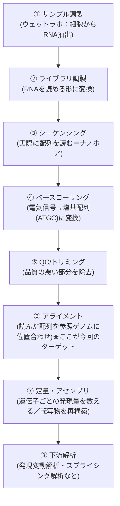
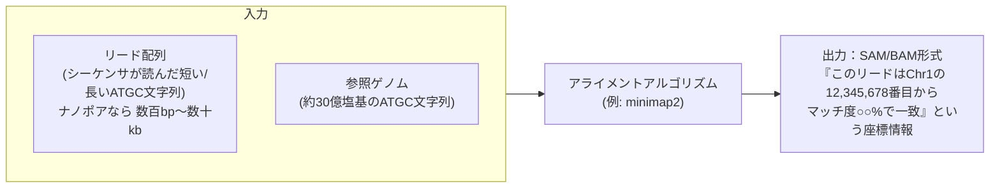
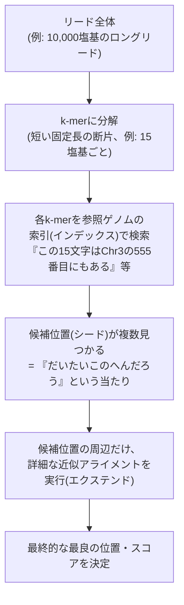

**user**: 全体の見た目を統一したい。
[Timestamp: 2026/08/29 20:02:40]

**ai**: 「全体の見た目を統一したい」だけだと、何の見た目を統一したいのか分かりません。もう少し教えていただけますか。ノートのプロパティ(フロントマター)の統一ですね。まず現状を把握するために、ノートのプロパティがどんな状態になっているか調査します。That search grabbed the wrong tools. Let me directly explore the vault content instead — I already have Glob/Grep/Read available as top-level tools.実際のノートは少数のようです。skills配下は除外して、各ノートのフロントマターを確認します。現状が把握できました。プロパティのばらつきは以下の通りです。

**フロントマターが全く無いノート(3件)**
- ものつくり/NGS Hard Accelalation.md
- ものつくり/3Dプリンター.md
- ものつくり/USB-シリアル変換・GPIO.md

**フロントマターはあるが項目がバラバラなノート**
| ノート | title | tags | created/date | description | aliases | cssclasses | status | author |
| --- | --- | --- | --- | --- | --- | --- | --- | --- |
| tale その一 | ✓ | ✓ | created | ✓ | | | | |
| tale その二 | ✓ | ✓ | created | | | | | |
| tale その三 | ✓ | ✓ | created | | | | | |
| index | ✓ | ✓ | date | ✓ | | | | ✓ |
| チートシート | ✗(なし) | ✓ | ✗ | | ✓ | ✓ | | |
| オーディオIF作成～入力～ | ✓ | ✓ | date | | | | ✓ | |
| オーディオIF作成 | ✓ | ✓ | date | | | | ✓ | |

主な不統一点は次の3つです。
1. 日付キーが `created` と `date` で混在している
2. フロントマター自体が無いノートが3件ある
3. `title` / `description` / `status` などの補助項目が付いたり付かなかったりする

統一する際、以下の方針でよろしいですか。日付キーは「created」、共通項目は title/tags/date/description ですが、質問の選択が矛盾しています(「created に統一」を選びつつ「date」を共通項目名として選択)。念のため確認させてください。了解しました。方針が固まったので作業に入ります。

- 共通プロパティ: `title`, `tags`, `created`, `description`(順序もこの通りに統一)
- `date` → `created` にリネーム
- フロントマターが無い3件にも新規追加
- `status`, `aliases`, `cssclasses`, `author` など上記4項目以外のものは、そのノートに元々あった場合のみ末尾に残す

各ノートの内容を全文読んでから編集します。全ファイル確認できました。それぞれの内容から適切な title/tags/description を推定して編集します。

まず、フロントマターの無い3件から着手します。次に、`date`/`created`の混在やdescription不足を統一します。tale その二・その三には description が無いので内容から追加、`date`は全て`created`にリネームします。最後に、チートシートには title/created/description が無いので追加します。全ファイルの統一結果を確認します。対象の10ノート(index.md, チートシート.md, tale 3件, ものつくり 5件)すべてに `title`/`tags`/`created`/`description` が揃いました(copilot配下のskillファイルはツール定義なので対象外)。

## 変更内容まとめ

**フロントマターを新規追加(3件)**
- ものつくり/NGS Hard Accelalation.md
- ものつくり/3Dプリンター.md
- ものつくり/USB-シリアル変換・GPIO.md

**`date` → `created` にリネーム**
- index.md
- ものつくり/オーディオIF作成.md
- ものつくり/オーディオIF作成～入力～.md

**`description` を追加**
- tale その二.md、tale その三.md
- ものつくり/オーディオIF作成.md、オーディオIF作成～入力～.md
- チートシート.md(`title`も追加)

これで全ノートが `title` / `tags` / `created` / `description` の4項目を共通の先頭プロパティとして持つようになりました。`status` / `aliases` / `cssclasses` / `author` など元々あった個別項目はそのまま残しています。
[Timestamp: 2026/08/29 20:02:40]

**user**: NGSのハードアクセラレーションの記事、これを独立したフォルダとして、研究するため区画として切り分けたい。
[Timestamp: 2026/08/29 20:08:25]

**ai**: 「NGSのハードアクセラレーション」を独立フォルダに切り分ける、という要望ですね。現状のノートと、他のフォルダ構成を確認してから進めます。他のノートからNGS関連ノートへのリンクがないか確認してから移動します。他ノートからのリンクは無いので、単純にフォルダを新規作成して移動できます。フォルダ名を確認させてください。`研究/NGS` フォルダを作成し、ノートを移動します。ファイル名の "Accelalation"(スペルミス)もこの機会に "Acceleration" に修正しますか、それともそのまま維持しますか？

一旦、現状のファイル名のまま移動を進めます。`研究/NGS/NGS Hard Accelalation.md` への移動が完了しました。

このノート単体で「研究区画」として独立させたので、他に必要であれば以下も検討できます。
- ノート内の `tags` に `研究` や区画を示すタグを追加する
- ノートの中身に研究テーマ・目的・TODOなど、研究ノートらしい構成を追加する

このまま内容は変更せず、フォルダ分けだけで完了としてよいですか、それとも中身も研究ノート用に整えますか。
[Timestamp: 2026/08/29 20:08:25]

**user**: 研究に必要なサブディレクトリとか、インデックスとか、
[Timestamp: 2026/08/29 20:10:40]

**ai**: 研究区画としての構成を整えたいということですね。ルートの `index.md` がどんな構成・トーンで書かれているか、既存の他ノートの雰囲気も踏まえて、NGS研究用のサブディレクトリとインデックスを設計します。

まず、参考になりそうな既存の類似構成(オーディオIFの2ノートのような「構想→詳細」の関係)を踏まえて、どんなサブディレクトリ構成にするか、ここは相談させてください。4つのサブテーマ全部ですね。以下の構成で進めます。

```
研究/NGS/
├── index.md                          ← 研究区画のインデックス(この階層のハブ)
├── NGS Hard Accelalation.md          ← 既存の構想メモ(そのまま)
├── アルゴリズム・パイプライン設計/
├── FPGA実装（Zynq）/
├── ベンチマーク・性能検証/
└── 参考文献・論文メモ/
```

各サブフォルダは、Obsidianでフォルダ自体をノートとして開けるよう、フォルダ名と同名の空ノートは作らず、まず `.gitkeep` 代わりに簡単な説明用ノートを1つずつ入れておきます(空フォルダはgit管理されないため)。

`index.md` はルートの `index.md` の書き方(見出し・コールアウト・タグ運用)に倣って作成します。4つのサブフォルダを作成しました。各フォルダに簡単な案内ノート(同名ノート)を1つずつ置き、空フォルダがgit管理外にならないようにします。最後に `研究/NGS/index.md` を作成し、区画全体のハブにします。ルートの `index.md` のトーン(見出し・コールアウト)を踏襲します。NGS研究区画の構成が整いました。

```
研究/NGS/
├── index.md                              ← 区画のハブ(サブディレクトリ一覧・起点メモへのリンク)
├── NGS Hard Accelalation.md              ← 既存の構想メモ
├── アルゴリズム・パイプライン設計/
│   └── アルゴリズム・パイプライン設計.md   ← 案内ノート
├── FPGA実装（Zynq）/
│   └── FPGA実装（Zynq）.md
├── ベンチマーク・性能検証/
│   └── ベンチマーク・性能検証.md
└── 参考文献・論文メモ/
    └── 参考文献・論文メモ.md
```

- 各サブフォルダには同名の案内ノートを置き、Obsidianでフォルダをクリックした時にすぐ内容の見出しが分かるようにしました(空フォルダはgit管理されないため、これで実体化しています)。
- `index.md` はルートの `index.md` と同じトーン(絵文字見出し・コールアウト)で書き、`[[NGS Hard Accelalation]]` や各サブフォルダへのwikilinkを張っています。
- フロントマターは前回統一した `title`/`tags`/`created`/`description` の形式に揃えています。

今後、各サブフォルダに論文メモや設計ノートを追加していけば、自然にこのインデックスからリンクが辿れる形になります。ファイル名 "Accelalation"(本来はAcceleration)のスペルミスはそのままにしていますが、直しますか？
[Timestamp: 2026/08/29 20:10:40]

**user**: スペルミスは直しておいて。
あと、今後君と研究に関しておしゃべりする内容は、適宜ここにまとめて、整理して、残しておいて。フォルダの構成とかも、適宜直してかまわない。
あと、これは
[Timestamp: 2026/08/29 20:14:04]

**ai**: スペルミスの修正はすぐ対応します。「あと、これは」で途中で切れているようですが、続きを教えてください。

まずスペルミスを直します。ノート内のtitleと、index.mdからのリンクも直します。ファイル名・title・index.mdのリンクすべて `NGS Hard Acceleration` に統一しました。

「今後おしゃべりする内容をここにまとめて整理して残す」件については、この`研究/NGS`区画に会話ログ・議論メモを蓄積していく運用として承知しました。具体的には、たとえば「ディスカッション」や「進捗ログ」のようなサブフォルダ(または日付ごとのノート)を作って、そこに要点を整理して書き溜めていく形になるかと思います。この点は追ってフォルダ構成に反映します。

なお、メッセージの最後が「あと、これは」で途切れています。続きを教えていただけますか。
[Timestamp: 2026/08/29 20:14:04]

**user**: あとこれはAuqrzで公開せれるから、見やすいように図とかをちゃんと多用してわかりやすいようにして。
出来れば、僕の思考をそのまま公開できるようにしてるメモ書きだから、僕の思考回路をトレースするように心がけて。
どんなことでも、出来るだけメモして、相互リンクとかも多用して。
[Timestamp: 2026/08/29 20:17:14]

**ai**: 運用方針、承知しました。整理すると以下の3点ですね。

1. **Quartzで公開される前提** — 図(Mermaidなど)を積極的に使って視覚的に分かりやすくする
2. **思考回路をトレースするメモ** — 結論だけでなく「なぜそう考えたか」「どういう順番で思考が転がったか」を残す(tale その一のエンジン燃焼ノートのような、思考の旅マップ形式に近い)
3. **こまめな記録 + 相互リンク多用** — 些細なことでもメモに残し、`[[wikilink]]`で関連ノート同士をどんどん繋げる

これは今後の会話ログ・進捗メモを書く際の執筆スタイルなので、メモリに残しておきます。MEMORY.mdがまだ無いので新規作成します。方針をメモリに保存しました。この後の運用で、実際に反映してみます。

まず `NGS Hard Acceleration.md` 本体に、この方針に沿って手を入れます。現状は箇条書き2行だけなので、思考のきっかけ・比較検討・図を加えて「思考をトレースできるメモ」に育てます。ただし、内容を大きく膨らませる前に一点確認させてください。では、実際の思考を教えてください。順番に伺います。なるほど。優先度としては「FPGA/ハード設計の技術的興味」と「学術/仕事上の必要性」が同じくらい大きく、「既存ソフトの遅さへの不満」は次点、ということですね。

もう少しだけ、思考をトレースする上で欲しい情報を聞かせてください。よく分かりました。「知人からのきっかけ→自分の知的好奇心で継続する趣味研究」というのは、まさに思考の軌跡として書く価値がありますね。

続けて、技術選定(FPGA・Zynq)の部分も少し聞かせてください。最後に、Zynqシリーズ・Z7-20の選定理由も確認させてください。これで思考の軌跡が見えてきました。「Zynq-7000/Z7-20を使い慣れていて手元にある」→「でもKV260が安くてメモリも大きいらしいと聞いて再検討中」という、まさに"今まさに揺れている思考"ですね。これは公開ノートの題材としてとても良い部分です。

ヒアリングした内容を元に、方針(図解・思考トレース・こまめなリンク)に沿ってノートを書き起こします。`NGS Hard Acceleration.md` を、ヒアリング内容をもとに書き起こしました。ポイントは以下の通りです。

- **思考の流れ図(Mermaid)** を冒頭に置き、「知人との会話→知的好奇心→FPGA選定→ボード選定で迷い中」という一連の流れを一目で追えるようにしました
- **動機の優先順位を明示**(技術的興味・知的好奇心 > 既存ソフトへの不満)し、なぜその順番だと今後の判断に効いてくるかも書き添えました
- **GPU vs FPGA、Zynq vs KV260** の比較は表とコールアウトで整理し、「KV260は結論が出ていない検討中事項」だと分かるようにしました
- 各セクションから `研究/NGS` 配下の4サブフォルダへ `[[wikilink]]` を張り、TODOリストとしても機能するようにしました

これが「思考をトレースする」書き方の一つの型になります。今後の会話でも、この形式(思考の流れ図→背景→検討中の分岐→TODO)をベースに育てていきます。

次に、この方針を各サブフォルダの案内ノートにも反映するか、あるいは実際に何かのサブテーマ(比較表作りなど)から会話を続けるか、どちらに進めますか。
[Timestamp: 2026/08/29 20:17:14]

**user**: 十中八九KV260にするけどね。
あと、メインはDNA-seqじゃなくてRAN-seqの方かな。
しかも、イルミナじゃなくてナノポアほ方ね。低品質だけど、スプライシングの事考えたらロングリードの方が有利な気がしてる。で、アライメントがかなり重い処理になってるから、そこを高速化したい。
[Timestamp: 2026/08/29 20:39:23]

**ai**: 重要な訂正・具体化が入りましたね。反映します。

- ボード: KV260でほぼ確定(Zynq-7000は「以前の第一候補」という位置づけに後退)
- 対象: DNA-seqではなく **RNA-seq**
- シーケンサ: Illuminaではなく **ナノポア(ロングリード)**
- 選定理由: ロングリードは低品質だが、スプライシングを考慮するとロングリードの方が有利という判断
- ボトルネック: **アライメント**が重い処理になっている、そこを高速化したい

いくつか、思考をきちんとトレースするために確認させてください。了解しました。それでは `NGS Hard Acceleration.md` を最新の思考に合わせて更新します。前回書いた内容の「揺れているところ」が決着し、対象も RNA-seq・ナノポア・アライメントに絞られたので、それを反映した形に書き直します。`FPGA実装（Zynq）`フォルダ名がKV260前提とズレてくるので、フォルダ名も相談したいですが、まずはノート本体を最新の思考に更新します。ボードがKV260にほぼ確定した以上、「FPGA実装（Zynq）」というフォルダ名は実態とズレます。どうしますか。フォルダ名を汎用化します。フォルダ名変更に伴い、中の案内ノート名・index.mdからのリンク・本体ノートからのリンクも合わせて修正します。リネームできました。中身のtitleとリンクを修正します。本体ノート内の `[[FPGA実装（Zynq）]]` リンクも新しい名前に更新します。`NGS Hard Acceleration.md` の「5.2 KV260に乗り換え」内の文言も、フォルダ名変更に合わせて微調整します。更新が完了しました。まとめると以下の変更を行いました。

**内容の更新(`NGS Hard Acceleration.md`)**
- 対象を DNA-seq → **RNA-seq**、Illumina → **ナノポア(ロングリード)** に絞り込み、その理由(スプライシング検出にはロングリードが有利)を明記
- ボトルネックが**アライメント**であることを明記し、根拠が「一般論＋論文」であって自分でまだ実測していないことも正直に記録(要検証事項として)
- ボード選定を Zynq-7000/Z7-20 → **KV260にほぼ確定** に更新し、決め手(価格・メモリ・想定リソース規模)を記載
- 冒頭のMermaid思考フロー図を、今回の一連の絞り込みが分かるように全面刷新

**フォルダ構成の変更**
- `FPGA実装（Zynq）` → `FPGA実装`(ボード名を外して汎用化)にリネーム
- 中の案内ノート・`index.md`・本体ノートのリンクと文言をすべて追従修正

これで「知人との会話→RNA-seq×ナノポアへの絞り込み→アライメントがボトルネック→FPGA選定→KV260への着地」という一連の思考が、図と文章でトレースできる状態になりました。次は実際にKV260のスペック比較や、アライメントの計算構造の深掘りに進めます。
[Timestamp: 2026/08/29 20:39:23]

**user**: まずは、既存の手順と手法を知っておきたい。普段回路屋だから、バイオはからっきしなんだ。
だからまずは、僕をバイオインフォの基礎研究員ぐらいまで育て上げてほしい。
そのために、色々質問して、それをまとめて、別のサブディレクトリでもいいからまとめておいてほしい。
[Timestamp: 2026/08/29 21:04:30]

**ai**: なるほど、「回路屋としての土台はあるが、バイオインフォマティクスはゼロから」ということですね。既存のNGS解析手順・手法(アルゴリズムの中身)を、質問形式で理解しながら学習ログとして残していく、という進め方で合っていますか。

まず、学習ログを置く場所を決めます。既存の4サブフォルダのうち `アルゴリズム・パイプライン設計` は「ハード化対象の設計検討」用に確保しておきたいので、学習用は別に切り出すのが良さそうです。構成イメージが分かりました。`基礎学習`をメインフォルダにして、その中に「バイオインフォ入門」的な位置づけのノート群と「用語・手法ノート」を持たせる、という形ですね。相互参照を意識して設計します。

```
研究/NGS/
└── 基礎学習/
    ├── 基礎学習.md          ← このフォルダの案内(index的役割)
    ├── バイオインフォ入門.md   ← 全体像・パイプラインの流れ(ハブ)
    └── 用語・手法ノート/       ← 個別の用語・手法を1ノートずつ
```

この構成で進める前に、学習の進め方を1点だけ確認させてください。では対話形式で進めます。まず全体像の把握度から確認させてください。了解です。本当にゼロからのスタートですね。回路屋さんの背景を活かして、できるだけ既知の概念(信号処理・パイプライン・データフォーマット)に例えながら説明していきます。

まず全体の地図を示してから、細かい所を埋めていく形にします。ここは質問ではなく、こちらから最初の説明をさせてください。

## RNA-seq解析の全体パイプライン(まず地図)



回路屋さん的に対応づけると:
- ①〜③は「アナログのセンサでデータを取得する」フェーズ
- ④ベースコーリングは「ADC(アナログ→デジタル変換)」に近い(実際、ナノポアは電流波形をニューラルネットでデコードして塩基配列にする)
- ⑤⑥⑦は「デジタル信号処理・パイプライン処理」に近い
- ⑥アライメントは「大量の短い/長いパターンを、巨大な参照データ(ゲノム、ヒトで約30億塩基)の中から最も似ている場所を探す、超大規模なパターンマッチング」

ここまでで、大枠のイメージは掴めましたか？次に、あなたが今回のターゲットにしている**⑥アライメント**が具体的に「何を入力にして、何を出力するのか」を掘り下げて質問していきます。アライメント自体がターゲットなので、そこを最優先で掘るのは理にかなっています。まず「参照ゲノムとは何か」という前提から、アライメントの中身まで説明します。

## ⑥アライメントとは何か

### 前提：参照ゲノムとは
- 人間なら「標準的な人間のDNA配列」として決められた約30億塩基のATGC配列のこと(実体は巨大なテキストファイル、FASTA形式)
- 「一人の完全な正解」ではなく、多くの人のデータから作られた「代表選手」のようなもの
- これが、いわば回路屋さんにとっての「マスターとなる参照テーブル/ROMデータ」に相当します

### アライメントの入出力



### なぜ「重い」のか(回路屋さん向けの直感)
これは「巨大なROM(30億エントリ)の中から、入力パターン(数百〜数万文字)に**近似一致**する場所を探す検索」に近いです。ポイントは:

1. **完全一致ではなく近似一致**(ミスマッチ・挿入・欠失を許容する必要がある) — シーケンサ自体にエラー率があるため
2. 素朴に総当たり(リードの全位置候補×参照の全位置)で比較すると、計算量が爆発する
3. だから実用ツールは「シード＆エクステンド」という2段階方式を使う(これは次の質問で深掘りできます)

RNA-seq特有の難しさとして、もう一つ重要な点があります。良い順番です。まず基本アルゴリズムを固めてから、RNA-seq特有の難しさに進みましょう。

## シード＆エクステンド方式

### 素朴な力任せ探索がダメな理由(復習)
リード(数百bp〜数十kb)を参照ゲノム(30億bp)の**あらゆる開始位置**に対して1文字ずつ比較すると、計算量は「リード長 × ゲノム長」のオーダーになり、現実的な時間で終わりません。

### 解決策：まず「短い完全一致」で候補を絞る(シード)



回路屋さん的に言うと：
- **シード探索** = 「ハッシュテーブル(参照ゲノムを事前に全部k-merに分解してインデックス化したもの)を引く」処理。**メモリアクセス律速**で、参照ゲノムのインデックスサイズが非常に大きい(ヒトゲノムなら数GB)のが特徴
- **エクステンド** = 見つかった候補位置の周辺だけ、動的計画法(DP)ベースの精密な近似文字列マッチング(Smith-Waterman型)をやる。**計算律速**で、こちらは小さい範囲に限定されるので現実的な計算量になる

つまり「広く浅く高速に候補を絞る(シード)」→「狭く深く精密に確認する(エクステンド)」の2段構え、という設計思想です。これはFPGA化を考える上でも重要なポイントで、**シード探索とエクステンドは全く性質の違う処理**(片方はメモリ律速のルックアップ、片方は演算律速のDP)なので、ハード化するなら別々に最適化する必要が出てきます。

### 用語の整理(ここまで出てきたもの)
- **k-mer**: 配列を固定長kで区切った短い断片
- **インデックス**: 参照ゲノムを事前にk-mer→位置の対応表にしておいたもの(minimap2は「minimizer」という間引いたk-merを使って索引を小さくしている)
- **シード**: k-mer一致から得られる「だいたいこの辺り」という候補位置
- **エクステンド**: シードを起点に、挿入・欠失・ミスマッチを許容しながら精密に伸長・スコアリングする処理ここまでの内容をノート化します。まずフォルダ構成を作り、これまでの2トピック(全体パイプライン、シード＆エクステンド)をそれぞれ用語・手法ノートとして残し、それらをハブする「バイオインフォ入門」ノートを作ります。次に「用語・手法ノート」の中に、シード＆エクステンドの詳細ノートを作ります。次に「バイオインフォ入門」ノート(全体像のハブ)を作ります。「用語・手法ノート」フォルダの案内ノート(フォルダ実体化用)も作成し、`index.md`とNGS Hard Accelerationからもリンクを張ります。`研究/NGS/index.md`に新サブフォルダを追加し、`NGS Hard Acceleration.md`からも学習ログへリンクします。`関連ノート`セクションに`基礎学習`へのリンクを追加します。ここまでの内容をノート化しました。構成は以下の通りです。

```
研究/NGS/
├── index.md                          ← サブディレクトリ一覧に「基礎学習」を追加
├── NGS Hard Acceleration.md          ← TODO・関連ノートに「基礎学習」を追加
└── 基礎学習/
    ├── 基礎学習.md                    ← フォルダの案内(進め方ログも記録)
    ├── バイオインフォ入門.md          ← 全体パイプラインの地図(ハブノート、進捗チェックリスト付き)
    └── 用語・手法ノート/
        ├── 用語・手法ノート.md         ← このフォルダの案内
        └── シード＆エクステンド方式.md ← 今回学んだ内容の詳細ノート
```

**学んだ内容の要点**
- RNA-seq解析は①サンプル調製〜⑧下流解析までの8工程からなり、④ベースコーリングは「ADC」、⑥アライメントは「大規模近似パターンマッチング」に相当する、と回路のアナロジーで整理
- アライメントは力任せ探索だと破綻するため、「シード探索(メモリ律速のk-mer索引検索)」→「エクステンド(演算律速のDP照合)」という2段構えで高速化している
- この2つは性質が全く違うため、FPGA化する際は別々に最適化する必要がありそう、という設計上の示唆も記録済み

`バイオインフォ入門.md`には進捗チェックリストを置いたので、今後の質問(スプライシングアライメント、ベースコーリング、ファイルフォーマットなど)はそこに追記しながら埋めていく形にします。次はどのトピックに進みますか。それとも今日はここまでにしますか。
[Timestamp: 2026/08/29 21:04:30]

**user**: あ、ごめん。一番重要なこと忘れてた。
AIで書いてるよてって、どっかに書いておきたい。
参照してくれた人がいたときに、迷惑かけちゃうといけないから。
[Timestamp: 2026/08/29 21:30:13]

**ai**: AI(私)が書いている・生成に関わっていることの明記ですね。重要な点です。どこに、どの範囲で書くか確認させてください。承知しました。

- サイト全体(`content/index.md`)には「一部の記事はAIとの対話を活用して作成している」という**部分的**であることを強調した断り書き
- `研究/NGS/index.md`には「この区画はAIを研究の補助として活用している」ことを**強調**した断り書き

の2箇所に、それぞれトーンを変えて書きます。まずルートの `index.md` の既存の免責事項ブロックを確認します。既存の免責事項ブロックに、AI利用について一文追加する形にします。次に `研究/NGS/index.md` に、強調したAI利用の注記を追加します。2箇所に断り書きを追加しました。

- **`content/index.md`(サイト全体)**: 既存の免責事項ブロックに「一部の記事はAIとの対話を活用して作成・整理している」という一文を追加(あくまで一部であることを強調)
- **`研究/NGS/index.md`(NGS区画)**: `[!danger]`コールアウトで目立たせ、「AIを研究の補助として積極的に活用している」「特に基礎学習は専門家レビュー未経過なので裏取りを」という、区画に強く紐づいた注記を追加

これで、この区画を読んだ人が「回路屋がAIと対話しながらバイオインフォを学びつつ研究している」という前提を最初に把握できるようになりました。他に、個別ノート(例えば`基礎学習.md`本体)にも同様の注記を入れておきますか、それともindexの注記だけで十分ですか。
[Timestamp: 2026/08/29 21:30:13]