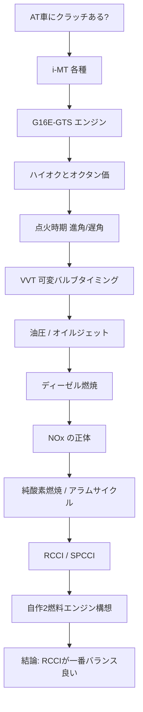
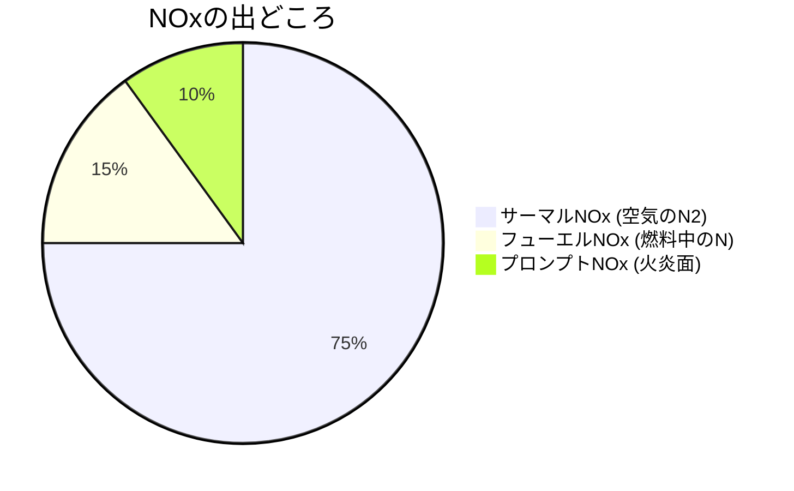
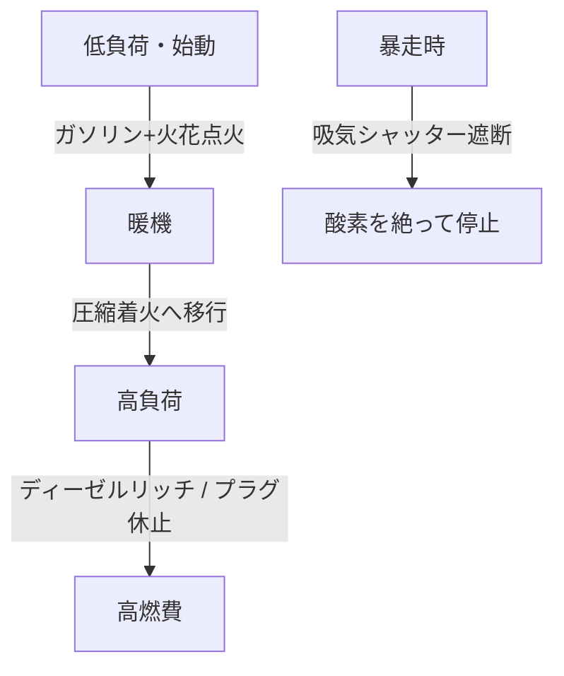

# エンジン燃焼まるわかり

> [!note] このノートについて
> 「AT車にもクラッチある？」という素朴な疑問から出発して、
> トランスミッション → エンジン → 燃焼理論 → 次世代エンジン構想
> まで一本道で繋がった思考の軌跡。※すべて公開情報ベース。

## 🗺️ 思考の旅マップ

---

## 1. トランスミッションとクラッチ

-  クラッチの断続を「**人がやるかコンピュータがやるか**」が MT / AT の本質的な違い
- 機構としてのクラッチは、どのAT方式にも形を変えて必ず存在する

| 方式                 | クラッチ操作             |
| ------------------ | ------------------ |
| MT                 | 人間（足＋手）            |
| AMT / DCT / トルコンAT | 機械（油圧・アクチュエータ・ECU） |

### i-MT の2系統（同名だが別物）

- **トヨタ系 iMT**：クラッチペダルは残し、シフト時の回転数を自動調整（オートブリッピング）
- **現代/起亜系 iMT**：クラッチペダルを廃した「クラッチレスMT」

---

## 2. G16E-GTS（1.6L 直3ターボ）

| 項目 | 値 |
|---|---|
| 種類 | 直列3気筒 DOHC ターボ |
| 排気量 | 1,618 cc |
| ボア×ストローク | 87.5 × 89.7 mm（ロングストローク） |
| 最高出力 | 304 PS / 6,500 rpm |
| 最大トルク | 400 N·m / 3,250–4,600 rpm |
| 燃料 | プレミアム（ハイオク） |

---

## 3. ハイオクとオクタン価

> [!tip] 核心
> オクタン価が高い＝**圧縮しても自己着火しにくい（アンチノック性）**

- ハイオクの利点：高圧縮比・進角・過給を攻められる → トルク・燃費UP
- 発熱量自体はレギュラーとほぼ同じ。「エンジンが本気を出せる」から速くなる

---

## 4. 点火時期（進角・遅角）

- 基準は**圧縮上死点（TDC）**
- 燃焼には時間差があるので、上死点より前（**BTDC＝進角**）で点火するのが基本
- **MBT**：トルク最大になる最小進角
- ノック検出時はECUが自動で遅角（リタード）してエンジンを守る

---

## 5. VVT（可変バルブタイミング）

| 駆動方式 | 動力源 | 特徴 |
|---|---|---|
| 油圧 ON/OFF | エンジン油圧 | 安価・実績。始動直後は動かない |
| 油圧リニアソレノイド | エンジン油圧 | 電流比例制御で高精度 |
| 電動（e-VVT） | ブラシレスモータ | 油圧不要で始動直後から動く |

- 低回転/アイドル：オーバーラップ小（安定重視）
- 中負荷巡航：オーバーラップ大（内部EGRで燃費）

---

## 6. オイルジェット

- メインギャラリーからピストン裏へオイルを噴射して**冷却**
- ノズル径 1〜2mm。ターボ・高出力エンジンで重要
- エンジンオイルは**潤滑・冷却・油圧作動**の3役をこなす

---

## 7. ディーゼル燃焼の本質

> [!important] 拡散燃焼
> 高温高圧の空気に燃料を噴射し、燃料の周りで局所的に燃える
> → **希薄可燃限界が実質なく、空気を増やしても止まらない**

- 暴走停止は「**酸素を絶つ（吸気遮断）**」が唯一確実
- メリット：高熱効率・高トルク・燃料が安全・CO₂少なめ
- デメリット：NOx・PM（すす）、後処理が複雑

---

## 8. NOx の正体

> [!warning] 主犯は「空気中の窒素」
> 燃料が純粋なCH化合物でも、**空気で燃やす限りNOxは出る**。
> 完全燃焼で高温にするほどサーマルNOxは増える（ゼルドヴィッチ機構）。

$$\mathrm{N_2 + O \rightarrow NO + N}$$

- 対策はすべて「**燃焼温度を下げる**」方向：EGR、噴射リタード、尿素SCR

---

## 9. 窒素を絶つ発想 → 純酸素燃焼 / アラムサイクル

- 窒素を排除すればサーマルNOxは原理的にゼロ
- でも窒素は「NOxの犯人」であると同時に「**温度を下げる冷却材**」でもある
- 抜くと3000℃超で溶ける → 代わりに**CO₂を冷却材として循環**（3原子分子で比熱大＝窒素より優秀）
- これが **アラムサイクル**（超臨界CO₂発電、実証プラント稼働中）
- 車載版の縮小形が**クールドEGR**

---

## 10. RCCI と SPCCI

| 名称 | 着火 | プラグ | 燃料 |
|---|---|---|---|
| RCCI | 圧縮着火 | なし | ガソリン（予混合）＋軽油（火種直噴） |
| SPCCI | 火花点火→圧縮着火 | あり | ガソリン（マツダ SKYACTIV-X） |

> [!tip] 味噌
> 着火性の違う2燃料を使い分け、予混合＋低温燃焼で
> **NOxとすすを同時に削減**（トレードオフ回避）

---

## 11. 自作2燃料エンジン構想（思考実験）

### 検証した各案と却下理由

| 案 | 却下/課題理由 |
|---|---|
| V8 左右バンク分割 | 左右非対称でローリング振動 |
| V8 前後直列 | クランクのねじり振動 |
| 交互配置＋共通クランク | 気筒ごと圧縮比違い＝製造困難 |
| 排気を隣へ過給 | 酸素不足＋NOx増（レシプロの希薄限界の壁） |
| **RCCI（同一気筒2燃料）** | ✅ 上記の弱点を全部回避 |

### なぜRCCIが一番バランス良いか

- 気筒を分けない → 振動・製造が破綻しない（クランク共通の思想と一致）
- 冷間始動は火花点火モードで立ち上げ（ガソリンの十八番）→ 暖機後RCCI
- 弱点（過渡制御）は専用ドライバECUで特化
- まず商用車（トラック等）から実用化が現実的

---

## 12. おまけ：マツダのロータリー

- **SPCCIはレシプロ直4**の技術。ロータリーとは無関係
- ロータリーは圧縮着火が苦手なのでSPCCIに不向き
- 現行ロータリーは**発電専用（シリーズHV / レンジエクステンダー）**として復活

---

## 🔑 今日の一本の軸

> **「燃焼温度を上げすぎない」**
> ——これ一本で、点火時期・VVT・EGR・NOx・純酸素・RCCI が全部繋がる。