# セキュアブート・TPM・UEFI ブートセキュリティ 総まとめ

> [!abstract] このノートの全体像
> 電源投入（リセットベクタ）から、OS起動・ディスク復号までの「ブートセキュリティ」を、
> 低レイヤーから体系的にまとめたもの。
> 大きく **3つの独立した仕組み** が並走している、という理解が核心。
>
> | 仕組み | 役割 | 一言 |
> |---|---|---|
> | **Secure Boot** | 署名を検証して**拒否**する | 門番 |
> | **Measured Boot (TPM/PCR)** | ハッシュを**記録**する | 書記官 |
> | **封印 (Seal)** | PCR一致時のみ**鍵を解放** | 金庫番 |
>
> この3者は同じ起動中に動くが、**互いに口をきかない別レーン**。

---

## 1. 全体マップ：電源からOSまで

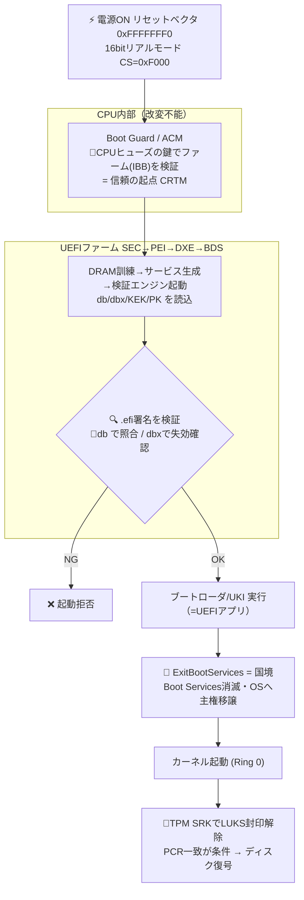

---

## 2. TPM ―― 物理・種類・役割

### 2-1. dTPM vs fTPM（別石か否か）

TPMは「別石のことも、CPU/チップセット内に溶けていることもある」。

| 種別 | 物理的な姿 | どこで動くか | バス |
|---|---|---|---|
| **dTPM**（ディスクリート） | 独立した専用チップ (Infineon/Nuvoton/ST) | CPU・RAMから**完全独立** | LPC / SPI / I²C |
| **fTPM / PTT** | 物理チップ無し | Intel=**CSME**内 / AMD=**PSP**(CPUダイ内ARM) | 内部バス |

- CPUから見ると TPMは **MMIOデバイス**。TIS/CRBは物理アドレス **`0xFED40000`** 付近にマップ。
- 20KiBが **4KiB×5 = ロカリティ**（特権レベル、0が最低〜5が最高）に分割。
- ACPI IDは `PNP0C31`。

> [!warning] dTPM最大の弱点：バススニッフィング
> LPC/SPI/I²Cは低速(25〜33MHz)で平文。$40のFPGAや安価なロジアナで、
> TPMが返す鍵を盗聴できる（TPM Genie等）。
> → **対策はTPM単独をやめ、PIN/物理キーで多要素化**。
> fTPMは外部バスが無い分スニッフィング耐性はあるが、CSME/PSPのファーム脆弱性を負う。

### 2-2. 判別方法

```bash
# Linux
cat /sys/class/tpm/tpm0/device/description
sudo journalctl -k --grep=tpm      # tpm_crb=fTPM傾向 / tpm_tis=dTPM傾向
sudo pacman -S tpm2-tools
tpm2_getcap properties-fixed | grep -A2 MANUFACTURER
#  → INTC=Intel PTT / AMD=fTPM / IFX,NTC,STM=dTPM（最も確実）
```

- UEFIの `TPM Device Selection` は **[Firmware TPM] / [Discrete TPM] の排他選択**。
- 物理的には両方載ることもあるが、**論理的には必ず一方に絞る**（両方有効だとBitLocker等の鍵が揺れて事故る）。切替時、無効化される側の封印鍵は消える。

### 2-3. TPMが保存しているものは「結局何か」

| 保存物 | 揮発性 | 中身 |
|---|---|---|
| **① 種鍵 (SRK/EK)** | 不揮発 | チップ固有の秘密鍵。**製造時から外に出ない** |
| **② PCR値** | 揮発（電源で消える） | 起動履歴を畳んだハッシュ1個 |
| **③ NV領域** | 不揮発 | カウンタ・小設定 |

> [!important] 誤解しやすい点
> - **LUKS封印鍵はTPMの中に無い** → ディスク上に「SRKで暗号化されたblob」として存在。
> - **起動履歴の"明細"もTPMの中に無い** → RAM上のイベントログ（下記）にあり、TPMには畳んだ合計値(PCR)だけ。
> - TPMは「明細帳」ではなく「印鑑(種鍵)と履歴の合計印(PCR)を守る金庫番」。

---

## 3. PCR（Platform Configuration Register）

### 3-1. 本質：TPM内で完結する一方向の積み増し

$$\text{PCR}_{new} = H(\text{PCR}_{old} \,\|\, H(\text{Data}))$$

- PCRはTPM内部の**揮発メモリ**。再起動でゼロにリセット。
- 書き換え手段は **`TPM2_PCR_Extend`のみ**。上書き命令は存在しない。
- 一方向性ゆえ、狙った値へ逆算して偽造するのは計算量的に不可能。
- 最初の16本(0–15)をリセットする唯一の方法はTPMリセット。
- **PCRバンク**：ハッシュアルゴリズムごと（SHA-1バンク / SHA-256バンク）。封印はバンクにも紐づく。

### 3-2. 全レーン（0〜23）

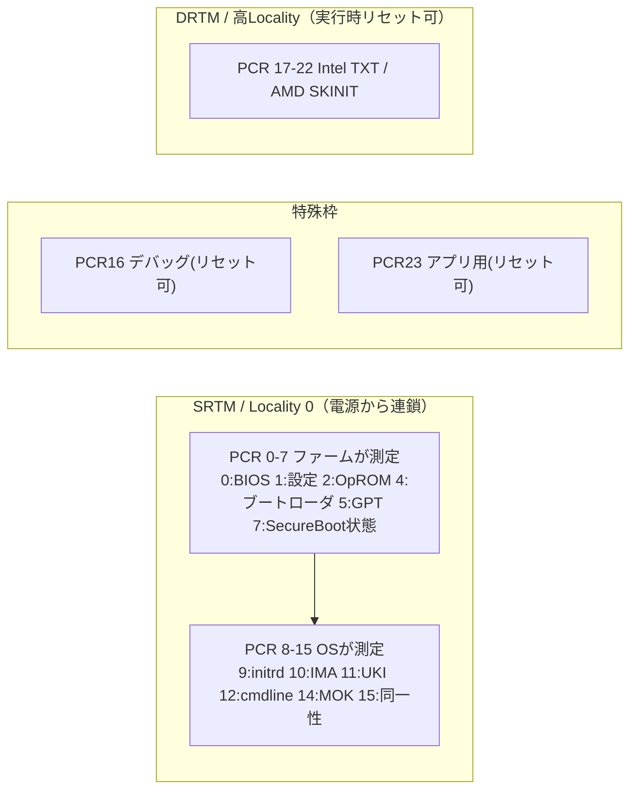

覚え方：**偶数=コード / 奇数=設定**。0-1=OEM, 2-3=サードパーティ, 4-5=OSブート, 7=SecureBoot。

### 3-3. 封印に使うPCRの選び方

| PCR | 変わる頻度 | 封印向き |
|---|---|---|
| **7**（SecureBoot証明書） | ほぼ変わらない | ◎ **第一候補** |
| 1,3（ハード構成） | ハード変更時 | ○ |
| 5（GPT） | パーティション変更時 | ○ |
| 0,2（ファーム） | ファーム更新で暴れる | △ |
| **4,9,11**（ブートローダ/カーネル/UKI） | **更新のたびに変化** | ✕ 地雷 |

> [!tip] 鉄則
> - 封印は **PCR7単独** が基本（更新に強い）。
> - 「PCRは薄く(7中心)、要素は厚く(TPM+PIN+物理キー)」。PCRを増やしても物理バス攻撃には無力、PINは効く。
> - systemd予約枠(11,12,13,15)に勝手に書くと保証対象外。自作測定はPCR16/23やNvPCRへ。

---

## 4. 封印(Seal)とLUKS連携

> [!note] 「PCR7に鍵を封印」の正しい意味
> 鍵はPCRの中にもTPMの中にも入らない。正しくは：
> $$\text{sealed\_blob} = \text{Enc}_{SRK}(\text{鍵} + \text{解錠条件「PCR7==正常時の値」})$$
> - **鍵の中身** → ディスク上の暗号化blob
> - **PCR7** → 鍵を開ける「錠前の形」（保管場所ではない）
> - **照合はTPMチップ内部で完結**。ホストOSを経由しない。

### 封印↔解錠は別のタイミング

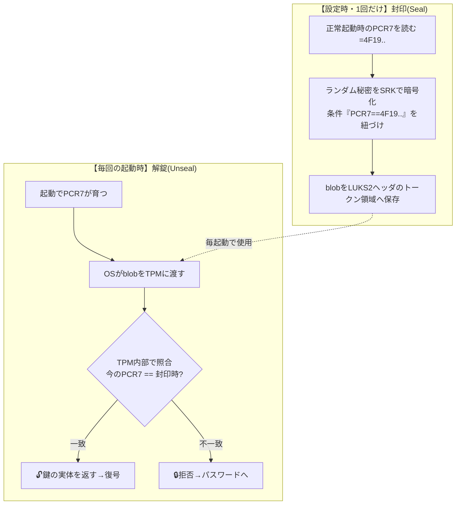

- OSがTPMに渡すのは **封印blob**（ディスクのハッシュではない）。TPMは**自分の内部PCR**を読んで照合する。
- LUKSは「暗号化済みディスクに、TPM開錠という合鍵を後付け登録」しているだけ（ディスク暗号化自体はTPM無関係に完了済み）。

```bash
sudo pacman -S tpm2-tss
sudo systemd-cryptenroll --wipe-slot tpm2 \
     --tpm2-device auto --tpm2-pcrs 7 /dev/nvmeXnXpX
# /etc/crypttab.initramfs:  root  UUID=...  -  tpm2-device=auto
# mkinitcpio HOOKS に sd-encrypt を含める
```

> [!danger] 攻撃者視点の整理（自分で検討した結論）
> - 偽TPMで「肯定応答」→ **✕**。Unsealは鍵の実体を返す。SRK秘密鍵が無いと正しい鍵を出せない。
> - .efiから生データ読んで鍵発見 → **✕**。封印鍵はディスク上のSRK暗号化blob。
> - EK証明書チェーンで「本物のTPMか」を暗号的に証明 → 純粋な偽装は不可。
> - **傍受/インターポーザで"本物のTPMに鍵を出させる"攻撃は成立** → 対策はPIN/物理キー+HMACセッション+パラメータ暗号化。

---

## 5. Secure Boot ―― 鍵の階層と検証

### 5-1. 信頼のピラミッド

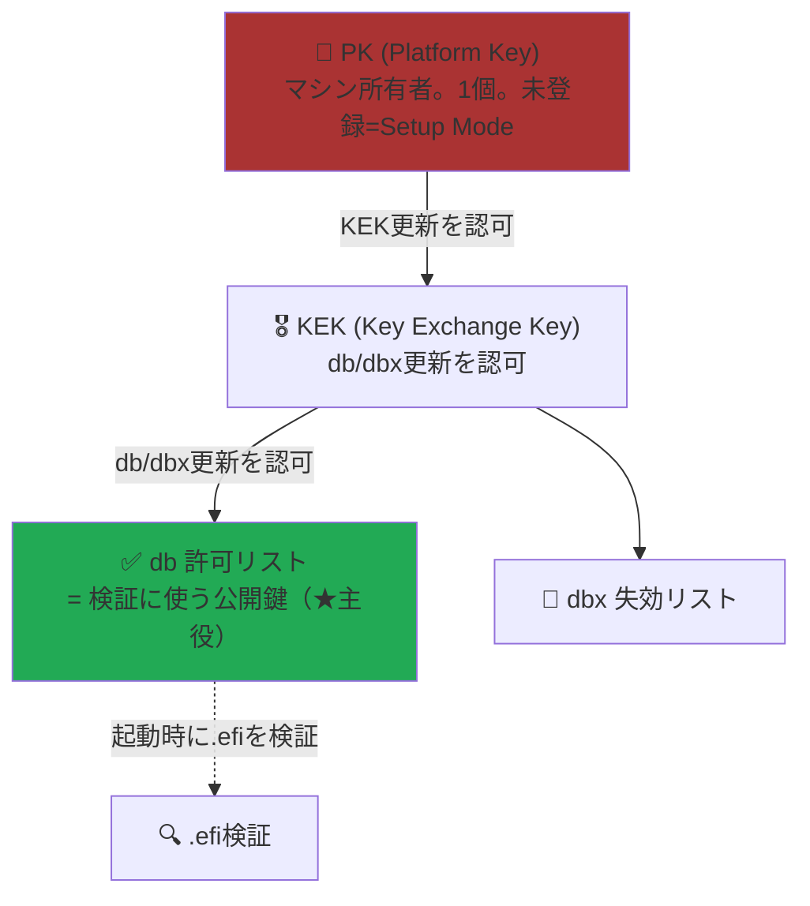

> [!important] 最大の誤解ポイント
> db/KEK/PKに"入っている"のは **公開鍵(証明書)**。署名する **秘密鍵は別の場所**（sbctlならディスク `/var/lib/sbctl/`、MSなら金庫）。
> $$\text{署名}=\text{Enc}_{\text{秘密鍵}}(H(.efi)) \quad,\quad \text{検証}=\text{Dec}_{\text{db内公開鍵}}(\text{署名})$$

### 5-2. 検証の3点照合

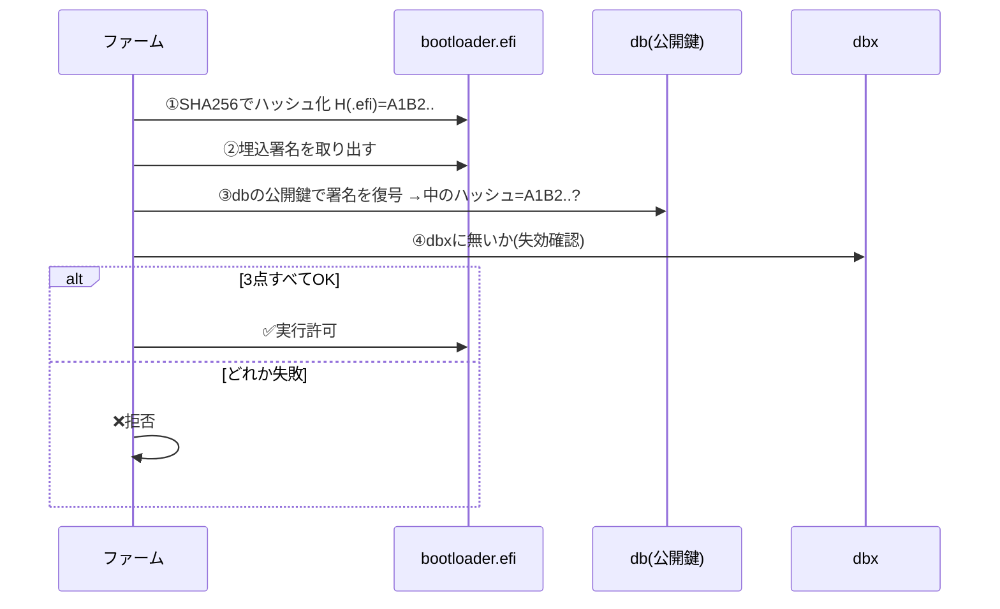

### 5-3. sbctl（自己鍵で固める）

```bash
# 事前: UEFIでSecure Bootを Setup Mode に
sudo pacman -S sbctl
sudo sbctl create-keys
sudo sbctl enroll-keys -m     # ★-m必須: MS鍵温存でオプションROM文鎮化を防ぐ
sudo sbctl sign --save /boot/EFI/.../xxx.efi
sbctl verify
```

---

## 6. 鍵の全種類（棚卸し）

3つの世界に分かれている。**①②が署名検証、③は暗号封印**で別物。

| 鍵 | 世界 | 検証/署名 | 外に出るか | 役割 |
|---|---|---|---|---|
| Boot Guard鍵 | 起点 | 検証 | ヒューズ固定 | ファーム自体を検証 |
| **PK** | ①SecureBoot | 権限 | 公開鍵をdb系に | KEK更新を認可（王様） |
| **KEK** | ①SecureBoot | 権限 | 公開鍵 | db/dbx更新を認可 |
| **db** | ①SecureBoot | **検証** | 公開鍵 | .efi署名検証（★主役） |
| **dbx** | ①SecureBoot | 検証 | ハッシュ/公開鍵 | 失効リスト |
| **MOK** | ②shim経路 | 検証 | 公開鍵 | shimが次段/モジュールを検証 |
| **SRK** | ③TPM | 封印 | **絶対出ない** | LUKS鍵を封印する種 |
| **EK** | ③TPM | 証明 | 秘密は出ない | チップ固有の身元 |
| **AK** | ③TPM | 証明 | 秘密は出ない | Quote(状態証明)に署名 |

- **Secure Boot = 署名で通す/弾く**、**TPM = 暗号で封印する/証明する**。同じ起動セキュリティでも根本的に別。

---

## 7. UEFIブートの内部（低レイヤー）

### 7-1. 6フェーズ

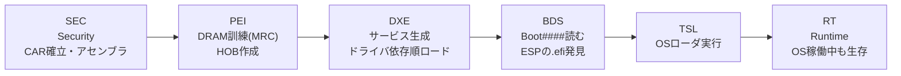

- **SEC**: 電源直後、DRAM未初期化。CPUキャッシュを一時RAM(Cache-as-RAM)化。信頼の起点。
- **PEI**: メモリ訓練で本物のRAMを起こす。HOBで次段へ引き継ぎ。
- **DXE**: `EFI_SYSTEM_TABLE` 経由で **Boot Services(gBS)** と **Runtime Services(gRT)** が生まれる。db/dbxはgRTの変数サービス。
- **BDS**: NVRAMの`Boot####`/`BootOrder`を読み、`\EFI\BOOT\BOOTX64.EFI`等を起動。

### 7-2. .efiのロードと実行

- .efiは **PE/COFF形式**（Windowsの.exeと同じ）。
- `LoadImage()`: メモリ確保→**再配置**→`EFI_LOADED_IMAGE_PROTOCOL`実装。**ここで署名検証が走る**。
- `StartImage()`: PEヘッダのエントリポイントへジャンプ。シグネチャは固定：
```c
EFI_STATUS EFIAPI efi_main(EFI_HANDLE ImageHandle, EFI_SYSTEM_TABLE *SystemTable);
```

### 7-3. ハンドオフ（国境 = ExitBootServices）

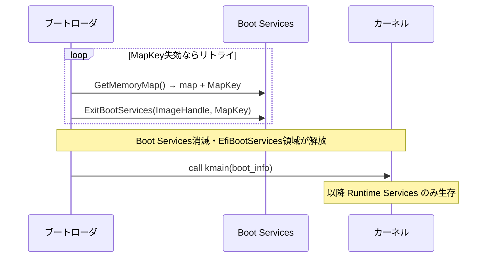

> [!note] 国境の意味
> - **UEFIの仕事**：ハード初期化 → ブートローダを検証して起動、まで。
> - **ブートローダ**：UEFIの居候。最後に `ExitBootServices()` を呼んで自らOSへ主権を渡す。
> - **その一点がUEFIとOSの国境**。以降 gBS消滅、ConOutすら消え、gRTのみ残る。

### 7-4. カスタムコードが動く場所

| レベル | 場所 | 難易度 |
|---|---|---|
| SEC | 生アセンブラ（ファーム改造必要） | 最難 |
| **DXE〜BDS** | **UEFIアプリ(.efi)** ← 現実的な入口 | 中 |
| UEFIシェル | `.nsh`スクリプト | 易 |
| OS起動後 | 普通のプログラム | — |

---

## 8. カーネル・ドライバ・ファームウェアの違い

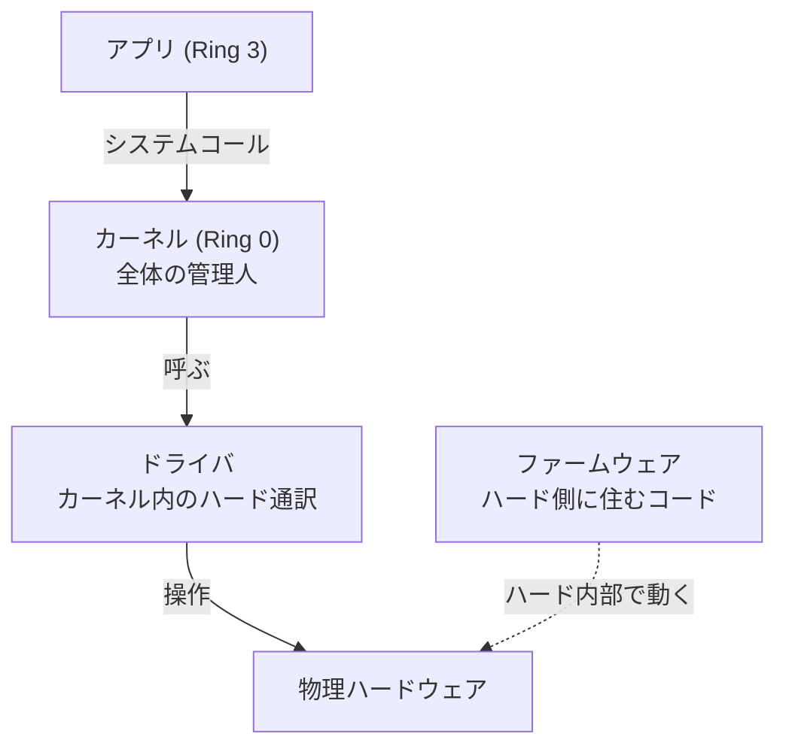

| | 住処 | 役割 |
|---|---|---|
| **ファームウェア** | デバイスのROM/フラッシュ内 | ハードの"中の人"（UEFI, ME, SSD/NIC firm, EC） |
| **ドライバ** | カーネル内(Ring 0) | 個別ハードの方言をカーネル共通語に翻訳 |
| **カーネル** | Ring 0 | プロセス/メモリ/FS/デバイスを統括 |

- **Ring 0=カーネルのみハード直叩き可**。アプリ(Ring 3)は必ずシステムコールという関所を通る。
- UEFIアプリはカーネル起動前なのでRing制約が緩く「素手でレジスタを叩ける」。

---

## 9. ファームウェア格納とカスタムファーム

### 9-1. SPIフラッシュの構造

```
Flash Descriptor（領域地図・権限表）
BIOS Region ← UEFI本体・ブートブロック・NVRAM(db/dbx/PK/KEK)
ME Region（Intel ME/CSME, fTPM）
GBE Region（LANファーム/MAC）
PDR（OEM情報）
```

### 9-2. OSから書けるか

- 書き込みは **SPIコントローラという門番** を通る。ロックされていればRing 0でも書けない。
  - **BIOS_CNTL**: `BIOSWE`(書込許可) / `BLE`(ロック→SMI発生) / `EISS(SMM_BWP)`(SMMのみ書込)。
  - **SPI保護レンジ(PR0-4)**: 一度設定でロック。
- 保護が甘いと `flashrom --programmer internal` や CHIPSEC でroot権限だけで書ける → **ファームインプラント(bootkit)** の温床。
- 正規の更新経路は **UEFI Capsule Update**（署名検証＋再起動後にファーム自身が書込）。

> [!tip] 最強の守り = 物理
> フラッシュチップの **WP#ピン / SRPラッチ** は電気的に書込を止める。SMMでもマルウェアでも不可。
> 「制御をハードにオフロード」思想の最終防衛線。

### 9-3. coreboot（カスタムファーム）

- coreboot/Libreboot はプロプライエタリBIOS/UEFIを置換。ハード初期化だけして**ペイロード**(edk2/SeaBIOS/LinuxBoot/GRUB/自作libpayload)を起動。
- できること：高速起動 / ペイロード自由 / **vbootで自分の鍵を焼く** / me_cleanerでME無効化 / OEM制限解除。
- **TPMは失われない**：coreboot単独でMeasured Boot対応、CRTMを自分で握れる。
- 壁：**Boot Guard有効だと自作ファームは起動拒否**。対応機種が少ない。FSP(Intelバイナリ)依存で完全オープンにはならない。
- 「正規手段で書く」＝Capsule Updateは署名必須で自作ファーム不可。flashrom直書きはSPI保護とBoot Guardの2つの壁。

---

## 10. UEFIアプリでできること・できないこと

> [!note] 置き場所
> UEFIアプリは **ESP上のただの`.efi`ファイル**（SPIフラッシュ書換とは別物）。
> 失敗しても削除すれば元通り。USBに置けば内蔵ディスクすら汚さない。安全・可逆。

### ✅ できる
- ハード直叩き（PCIコンフィグ / MMIO / I/Oポート / MSR / CPUID）
- GOPでフレームバッファ直描画（GUI・DOOM移植すら）
- ファイル操作（ESP読み書き / Block I/O）
- ネットワーク（SNP→MNP→IP4、ping相当、PXE/HTTPブート）
- TPMアクセス（PCR読み・拡張）
- ブート制御（LoadImage/StartImage = チェインロード）
- マルチコア（MP Services で AP に仕事を投げる、制限付き）

### ❌ できない/向かない
- **プリエンプティブ・マルチスレッド**（スレッド・スケジューラが無い）
- **OSと並行常駐**（ExitBootServicesで解体される）
- デバイス割り込み（タイマー以外は基本使わずポーリング）
- ミューテックス/セマフォ（あるのはRaiseTPLのみ）

### マルチコア/マルチタスクの正確な区別

| 概念 | UEFI | 実態 |
|---|---|---|
| マルチコア | ○ | MP Services(BSP/AP, StartupAllAPs)。ReadyToBoot後は機能縮小 |
| マルチタスク | △ | TPL+イベントの**協調的**疑似マルチタスク（タイマー寄生） |
| マルチスレッド | ✕ | 存在しない |

- **TPL**: APPLICATION(4) < CALLBACK(8) < NOTIFY(16) < HIGH_LEVEL(31)。高が低をプリエンプト。
- **同一TPL内は無限ループすると全部止まる**。唯一のブロッキングは `WaitForEvent`。
- 「ハード版top」は作れるが**無限ループ禁止→タイマーイベントで定期更新**する。

---

## 11. リアルタイム性 / 計算性能

> [!warning] 「UEFIで大規模計算は速くなる？」→ No
> 計算中はそもそもカーネルが介在していない（syscallを呼ばない）。
> むしろ **ターボブースト不可・1コアのみ・最適化ライブラリ(MKL等)無し** で遅くなる公算。
> ベアメタルの真価は「速さ」ではなく **決定論性（揺らぎの無さ）**。

> [!important] 「正確に1msごと」の正解
> PCのUEFIアプリは**不向き**（協調モデル + SMM割り込み + 粗いタイマー）。
> $$\text{正確な1ms} = \underbrace{\text{水晶}}_{ハード}\to\underbrace{\text{タイマー}}_{ハード}\to\underbrace{\text{割り込み}}_{ハード}\to\underbrace{\text{タスク}}_{ソフト}$$
> ソフトで時間を数えない。**時間生成をハードに追い出す**。真のRTは組込みMCU/FPGA。

- SMM(Ring -2)はOSにもUEFIにも透過的に割り込み、数百μs〜msCPUを奪う → 周期を狂わせる。
- OSと並行したハード監視の正解は UEFIアプリではなく **BMC/IPMI**（基板上の別コンピュータ）、SMM、Intel ME/AMT。

---

## 12. EC（Embedded Controller）とファン制御

- ノートPCのファンを回すのは UEFIでもCPUでもなく **EC**（=ノートPC版BMC、独立マイコン、自前ファーム）。
- OS制御できない原因：①メーカーが標準I/F（ACPI/PWM）を公開しない ②ECの自動モードが上書き ③UEFI内ACPIテーブルの記述が貧弱。主犯はECファーム+囲い込み。
- 回避：**NBFC-Linux** でECレジスタ直叩き。`acpi_enforce_resources=lax` + `ec_sys write_support=1`。
- ⚠️ Secure Boot有効だとEC書込が弾かれる → DKMS署名で両立（下記）。

---

## 13. DKMS（Dynamic Kernel Module Support）

- **out-of-treeモジュールを、カーネル更新のたびに自動リビルドする仕組み**。Archはpacmanフックで全自動。
- 必要：`dkms` + 対応する `linux-headers`。
- ライフサイクル：`add`（登録）→ `build`（現カーネル用にコンパイル）→ `install`（配置+depmod）。

### 自分でDKMSを組む場面
1. **自作ドライバ**を書いた時（本命）
2. カスタムハード/組込みボード用ドライバ
3. 既存モジュールを改造（EC制御等）
4. 上流に無い/古いドライバのバックポート
5. ソースだけのサードパーティドライバ

```bash
# /usr/src/mydrv-1.0/dkms.conf 最小例
PACKAGE_NAME="mydrv"
PACKAGE_VERSION="1.0"
BUILT_MODULE_NAME[0]="mydrv"
DEST_MODULE_LOCATION[0]="/kernel/drivers/misc"
AUTOINSTALL="yes"
```
```bash
sudo dkms add mydrv/1.0 && sudo dkms build mydrv/1.0 && sudo dkms install mydrv/1.0
dkms status
```

### Secure Bootとの両立（MOK署名）
- DKMSは初回ビルド時に自己署名鍵(`/var/lib/dkms/mok.*`)を自動生成し、毎回自動署名。
- `sudo mokutil --import /var/lib/dkms/mok.pub` → 再起動 → 青画面「Enroll MOK」で登録。
- **sbctl自己鍵構成なら**、`/etc/dkms/framework.conf`でsbctlの鍵をDKMSに使わせ、**db経由で統一**するのが綺麗（MOK不要）。

---

## 14. ブートローダ = UEFIアプリ

> [!important] 規格レベルで同一
> systemd-boot / GRUB(EFI版) は **UEFIアプリケーション(OSローダ)そのもの**。
> ファイル形式(PE/COFF)・エントリ(efi_main)・置き場所、全部 自作Hello World と同じ。
> **唯一の違いは「最後にExitBootServicesを呼んでOSへ橋を架ける」こと**。
> → 自作アプリ + カーネルロード + ExitBootServices = ブートローダの正体。UKIはこれをカーネル側に束ねたもの。

### コンソール2種
| 名前 | 正体 | 目的 |
|---|---|---|
| **GRUBコマンドライン `grub>`** | GRUB自身のミニシェル | 起動失敗時、手動で `ls`/`set root`/`linux`/`initrd`/`boot` |
| **UEFI Shell** | ファーム標準のシェル(=UEFIアプリ) | `map`/`bcfg`/`.efi実行`。OS手前でファーム操作 |

---

## 15. Secure Bootは誰が検証するか（shim例外）

- 基本：**署名検証はファームの仕事**。ファームが`LoadImage`する瞬間に db/dbx で検証。ブートローダは"検証される側"。
- 例外：**shim**（MS署名済みUEFIアプリ）は「次段を自分で検証する」。ファームがMS鍵しか信頼しない問題を、**MOK/ディストリ鍵で橋渡し**。

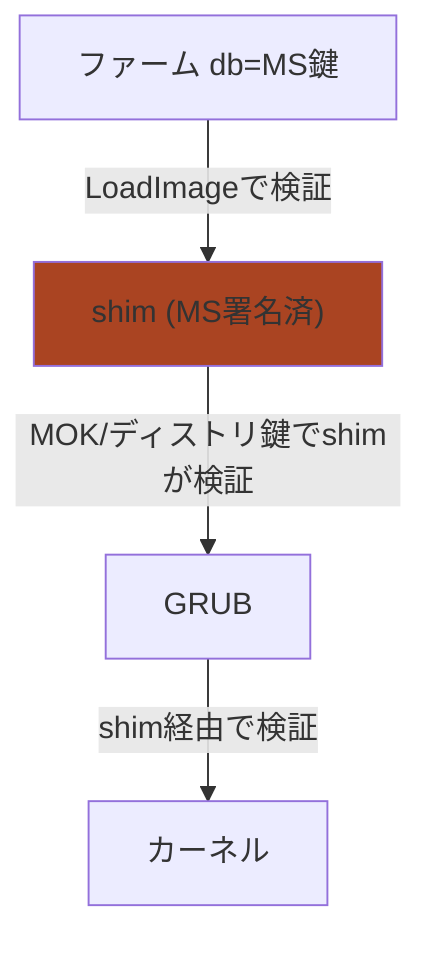

---

## 16. shim / UKI / TPM の関係と最終判断

> [!important] 混同禁止：軸が違う
> - **shim vs sbctl** = 「**誰が検証するか**」の軸（信頼の経路）
> - **UKI** = 「**何を署名するか**」の軸（署名対象の束ね方）
> - この2軸は掛け算。UKIはshimともsbctlとも組み合わせ可。

### UKIの価値
- カーネル+initramfs+cmdlineを1つの`.efi`に束ねる。
- **従来署名されなかった initramfs/cmdline の隙間を丸ごと署名で潰す**。
- Measured Bootでも1単位で測定。ブートローダレスも可（`\EFI\BOOT\BOOTX64.EFI`直置き）。

### shim vs sbctl自己鍵

| 観点 | shim使用 | sbctl自己鍵 |
|---|---|---|
| SecureBoot達成 | ◎ | ◎ |
| 設定の手軽さ | ◎ | △ |
| 自己主権・MS非依存 | ✕ | ◎ |
| 攻撃対象面 | やや広い | **最小** |
| 文鎮化リスク | 低 | 中（-m必須） |
| Windowsデュアルブート | ◎ | ○（-m必須） |
| カスタマイズ性 | △ | ◎ |

### ★環境別の最終決定

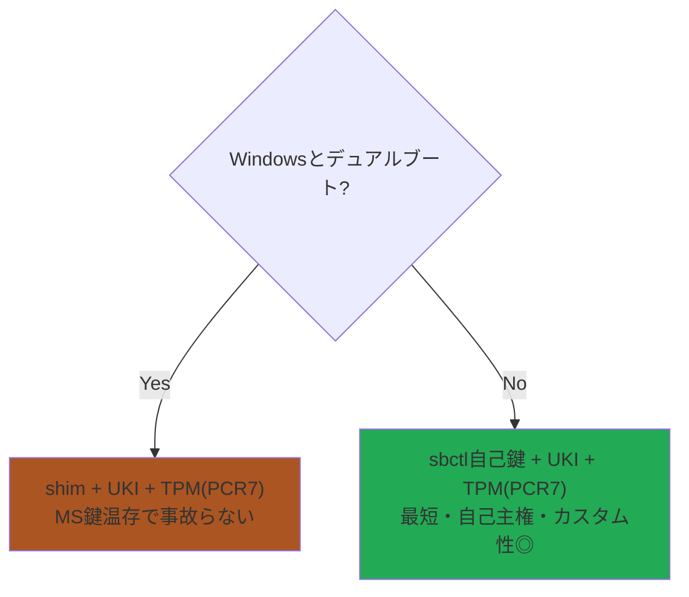

> [!warning] TPM × デュアルブートの相性
> BitLockerとLUKSは同じTPMだが別blobで封印（保存は競合しない）。だが：
> - **Linux追加/ブート構成変更 → PCR7変化 → BitLockerが回復キー要求**。
>   対策：**変更前にWindowsでBitLockerをsuspend**（回復キー必ず保管）。
> - shim更新でPCR7が変わると **LUKSの再エンロール**が必要。
> - よって **BitLockerとの相性が悪いのがマルチブートの弱点**。
> - **マルチブートしないなら shim不要 → sbctl自己鍵の方がカスタマイズ性が良い**（結論）。

---

## 17. 理想構成（Linux単独）

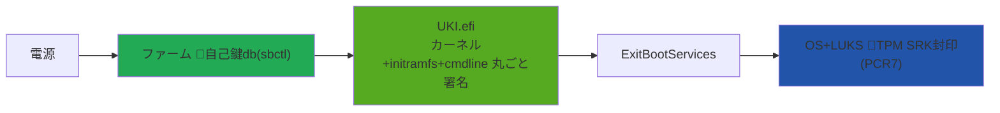

**sbctl自己鍵 × UKI × TPM(PCR7)** … 登場する鍵が **db と SRK の2つだけ**に集約。

> [!todo] 単独構成でも忘れないこと
> - [ ] `enroll-keys -m` でMS鍵を残す（オプションROM文鎮化防止）
> - [ ] 回復手段確保（Setup Mode復帰手順、LUKS回復キー保管）
> - [ ] sbctlのpacmanフックで、カーネル/UKI更新時の再署名を自動化

---

## 18. 一言サマリ（全体の芯）

- **Secure Boot=門番（署名で拒否）／Measured Boot=書記官（記録）／封印=金庫番（PCR一致で解錠）**。3つは別レーン。
- **TPMは検証装置ではなく「種鍵とPCRを守る金庫番」**。畳んだPCRを内部に持ち、Unsealだけ内部照合。
- **db等に入るのは公開鍵、署名する秘密鍵は手元**。ここが鍵理解の要。
- **ブートローダ=UEFIアプリ**。違いはExitBootServicesを呼ぶかだけ。
- **UEFIアプリはESP上のファイル**（ファーム書換ではない）。安全・可逆。ハード直叩き可だがマルチスレッド不可・OSと並行不可。
- **リアルタイム/監視の本命はハード（MCU/FPGA/BMC）にオフロード**。
- **構成判断：Windows併用ならshim、単独ならsbctl自己鍵。どちらもUKI+TPM(PCR7)を組み合わせる**。
