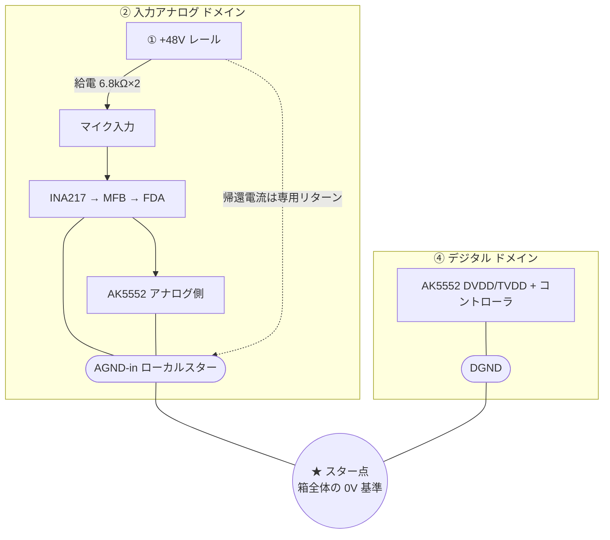
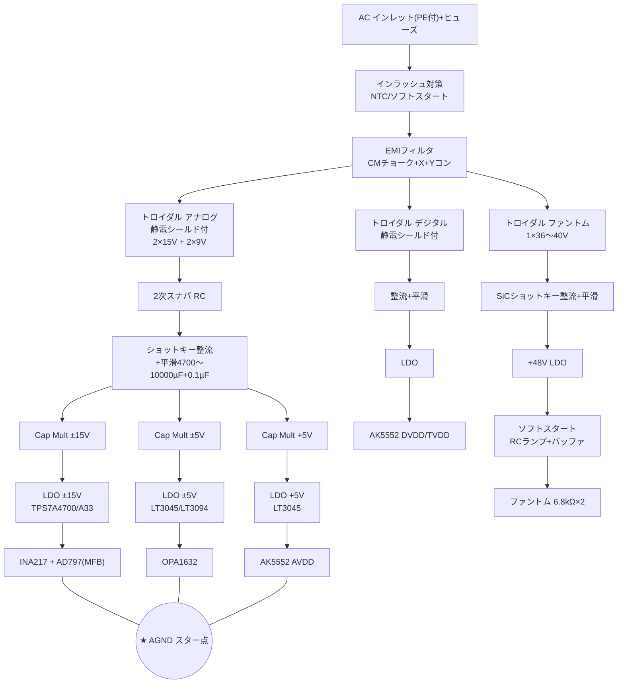

# 自作オーディオI/F 設計まとめ

> [!info] このノートについて
> オーディオI/F自作における「電源系ノイズと設計」の検討ログ。
> 入力段（マイク）〜ADC〜電源部までの確定事項と、残タスクを整理したもの。
> ※部品の数値・型番で「※要確認」が付くものは、データシートでの最終確認が必要。

---

## 1. 全体コンセプト

- **用途**: 会話・歌がメイン（ボーカル録音中心）
- **入力**: 2系統
  - ① マイク入力（コンデンサ／ダイナミック両対応, XLR, ファントム給電）
  - ② ライン入力（外部音源, 例: PCのオーディオ出力）
- **設計思想**:
  - 超低ノイズ・完全バランス（差動）を最後まで貫く
  - 電源・GNDを**ドメイン（島）で分離**し、最後に**スター1点**で結合
  - アナログ電源は全て「**整流 → 平滑 → Cap Multiplier(MOSアクティブフィルタ) → LDO**」で統一
  - スイッチング電源・昇圧は極力避け、ハードで対称に作る

---

## 2. 電源ブロック分割

> [!note] ドメインの考え方
> 1ドメイン = { +V, -V, GNDリターン } の**三点セットが1組**。
> ドメイン内では +/- は共通GNDに戻す。ドメイン間はスター点1箇所だけで結合。

| # | ブロック | 中身 | 性格 |
|---|---------|------|------|
| ① | ファントム | +48V 単電源（専用巻線） | 高電圧・低変動・安全重視 |
| ② | 入力アナログ | ADC入力段, マイクプリ, ライン受け | 小信号・クリーン |
| ③-a | 出力アナログ | DAC, VREF | 小信号・最優先クリーン |
| ③-b | 出力ドライブ | HP / モニタ出力段 | 大電流・変動大 |
| ④ | デジタル | コントローラ, I/O | ノイズ源側 |
| ⑤ | クロック | OCXO専用 | 最優先で独立 |

※本ノートは主に **①②** と、その電源部を詰めた段階。

---

## 3. 入力段（マイク）信号経路 ★確定

```
XLR
 → ファントム給電 6.8kΩ × 2ペア（高精度）
 → DCカット：無極性AL 22µF + フィルム 0.1µF（耐圧63V以上）
 → バイアス抵抗 2.2kΩ × 2（対称・高精度ペア）      … fc ≈ 3Hz（ハイパス）
 → INA217（固定ゲイン +30dB / RG=324Ω, シングル出力）  ← 主増幅
 → MFB LPF（AD797, ±15V, fc≈200kHz, R1ポットでゲイントリム） ← アナログ音量調整
 → FDA（OPA1632, +6dB, シングル→差動, VOCM←ADCのVCM）  ← 国境（0V中心→VCM中心）
 → 差動RCスナバ（Rs=22〜33Ω×2, Cdiff=1〜2.7nF C0G/NP0）
 → ADC（AK5552, 差動入力ΔΣ, 24bit/192kHz超）
 → FPGA/MCU（I2S/TDM受け, デジタル微ゲイン）              ← 微調整
```

### 3.1 各定数の根拠

> [!tip] DCカット + バイアス抵抗（ハイパス fc≈3Hz）
> - fc=3Hz は「20Hzで-0.1dB以下」「回復0.4〜0.6s」の谷間。可聴帯域フラット・過渡回復も実用範囲。
> - `C = 1 / (2π · fc · R)`
> - R=2.2kΩ → C≈24µF（標準22µF採用）
> - DCカットは無極性AL＋フィルムのハイブリッド（過渡の極性反転＋高周波対応）

> [!tip] バイアス抵抗 2.2kΩ を選んだ理由
> - DCオフセット（Ib×R）が小さい / EMI耐性が高い（低インピーダンス）
> - 実装難易度は不問という前提で、素性（電気特性）を優先

### 3.2 ゲイン配分

```
総アナログゲイン = INA217(固定+30dB) + MFB(可変トリム ±15dB)
                 → 実効 +15 〜 +45dB
デジタル微調整   = ADC後で 0〜数dB 補間（連続化）

【根拠：AT2020(14mV/Pa ※要確認) で会話〜歌】
  90dB SPL(ソフト語り) →  8.8mVrms → 必要 約+47dB
 118dB SPL(ピーク)     →  221mVrms → 必要 約+19dB
  → 中心 +33dB付近。INA217を+30dB固定に置き、MFBで前後を吸収。
```

> [!warning] なぜ主増幅は前段(INA217)で稼ぐか
> Friisの法則：最初に増幅する段のノイズがシステムのノイズフロアを決める。
> 大きなゲインは必ずINA217で。MFBは"広い増幅"でなく"±15dのトリム"に留める。

---

## 4. 主要IC選定 ★確定

| ブロック | 型番 | メーカー | 選定理由 |
|---|---|---|---|
| マイクプリ（計装アンプ） | **INA217** | TI | 低ノイズ約1.3nV/√Hz※, 単一RGゲイン, 入手性・信頼性◎ |
| MFB LPFオペアンプ | **AD797** | ADI | 高GBW(約110MHz※)×低ノイズ(約0.9nV/√Hz※)。広トリムに強い |
| FDA（差動化ドライバ） | **OPA1632** | TI | オーディオ用FDA定番, VOCMピンでVCM合わせ |
| ADC | **AK5552** | 旭化成(AKM) | 日系フラッグシップ, 差動入力, DR約120dB級※, AVDD/DVDD別ピン |

> [!note] メーカー選定のメモ
> - 差動出力マイクプリ（THAT1580等）も検討したが、THAT CorpはADCを作らないため見送り。
> - LPFはシングルで設計（差動よりペアマッチング不要で楽）→ FDAで差動化。
> - FDAは日系に良い専用モノリシック品がなく、TI(OPA1632)を採用。
> - AKMは2020年の工場火災後に生産復旧。現行入手性は発注前に要確認。

---

## 5. LPF設計メモ（MFB, fc≈200kHz）

> [!tip] なぜ fc を 200kHz と高めに置くか
> ΔΣ ADC は折り返しの脅威が数MHz以上。急峻なAAFは不要。
> 一方 192kHz動作でナイキスト=96kHz。ここをフラットに通したいので fc は高めに逃がす。
> `fc=200kHz 2次Butterworth → 96kHzで約-0.23dB（ほぼフラット）`

```
反転MFB 2次LPF：
  DCゲイン ： H0 = -R2 / R1        （R1=トリムポット, ゲインを決める）
  遮断    ： fc = 1/(2π·√(R2·R3·C1·C2))  ← R1に依存しない（fc固定のままゲイン可変）

推奨値（fc≈200kHz）：
  R2 = R3 = 1.69kΩ（E96）
  C1 = 1nF   （C0G/NP0）
  C2 = 220pF （C0G/NP0, 帰還）
  R1 = 390Ω固定 + 1.3kΩポット → R1=390〜1690Ω
       ⇒ ゲイン ≈ +12.7dB 〜 0dB（fcは200kHz固定）

検算： fc = 1/(2π·1690·√(1n·220p)) ≈ 200kHz  OK
```

- R1に固定抵抗を直列 → ポット0Ω時の「ゲイン∞」を防ぐ（必須）
- ゲインを上げるとQが下がる（なだらか側）＝ΔΣ前段では安全
- R1ポットは信号経路 → ガリ・接触ノイズの少ない信頼性の高い品を奢る

---

## 6. GND戦略（スター1点結合）

> [!important] GNDの二役
> GND = 「電流の帰り道（リターン）」と「電圧の基準(0V)」の二役。
> 島の中では帰り道、島同士が触れるスター点では基準。



- ファントム(①)は「**レールは独立巻線 / GND基準は②に属する**」という非対称な位置づけ
- ファントム帰還電流は専用リターンで引き、②のローカルスターで合流（信号GNDと分ける）
- AK5552は②(アナログ)と④(デジタル)の**国境**。AVDD/AGND=②, DVDD/DGND=④

---

## 7. 電源部 詳細設計

### 7.1 必要レール一覧

| レール | 供給先 | 由来 |
|---|---|---|
| ±15V | INA217 + MFB(AD797) | アナログ大巻線 2×15〜18V |
| ±5V | FDA(OPA1632) | 低圧巻線 2×7〜9V（±15Vからでなく低圧巻線で作り、発熱を削減） |
| +5V AVDD | AK5552 アナログ | ±5Vの+側生バス共有 or 専用巻線 ※要確認 |
| DVDD/TVDD | AK5552 デジタル | **別トランス（デジタル系）** |
| +48V | ファントム | 専用巻線（昇圧しない＝スイッチングノイズ回避） |

> [!note] ±5V の作り方（確定案）
> 約9V巻線を2つ独立に整流・平滑 → 直列にして中点=AGND で ±化。
> - +側：Cap Mult→LDO を **FDA用とADC AVDD用に別系統**で分離（レール=LDO後は共有しない）
> - -側：Cap Mult→LDO で FDAのみ
> - 独立整流なので +/- 非対称負荷でも問題なし（+側を余裕もってサイジング）

### 7.2 部品選定

| 部位 | 推奨 | メモ |
|---|---|---|
| トランス | トロイダル・**静電シールド付**（Plitron等※） | 1次-2次結合ノイズを断つ最重要点。シールドはPEへ |
| AC入口 | メディカルEMIフィルタ（Schaffner等※）+ X/Yコン | 安全規格認証品必須 |
| インラッシュ | NTC or リレー式ソフトスタート | トロイダルは突入大 |
| 2次スナバ | R=10〜100Ω + C=10〜100nF（各巻線並列） | 整流リンギングのダンプ |
| 整流Di | **ショットキー**（±5/±15V）, SiC/ソフトリカバリ(+48V) | 逆回復ノイズを断つ |
| 平滑Co | 4700〜10000µF + 0.1µFフィルム並列 | 大きすぎ注意（突入増）|
| Cap Mult | Nch/Pch MOSFET + Rg(1〜10k)・Cg(100〜470µF) | 各レール独立, 放熱はビア+筐体 |
| LDO ±15V | **TPS7A4700 / TPS7A33**（TI）※ | 高耐圧・超低ノイズ |
| LDO ±5V/AVDD | **LT3045 / LT3094**（ADI）※ | 出力ノイズ約1µVrms※。AVDDは最静音を |

> [!tip] リプル計算
> `Vripple(pp) ≈ I_load / (2 · f_line · C)`
> 例: I=100mA, f=50Hz, C=4700µF → 約0.21Vpp（後段Cap Mult+LDOが叩く前提でOK）

### 7.3 ファントム +48V ソフトスタート ★NEW

> [!important] マイク保護が目的
> コンデンサマイクは+48Vの急な立ち上がりでダイヤフラムに衝撃（"ボンッ"）。
> なだらかな坂で立ち上げて保護する。

```
+48V LDO 出力
 → [ 直列R + 大容量C で電圧ランプ生成, τ=R·C を秒オーダー ]
 → [ エミッタフォロワ / MOSソースフォロワでバッファ ]
 → 6.8kΩ×2 → XLR

目安：τ ≈ 1〜3秒（例 R=100kΩ, C=10〜33µF）
補足：
 - LDOにSSピン/EN遅延があればCを1個足すだけでランプ可
 - ファントムON/OFFはリレー一括切替、OFF時はブリーダーでゆっくり放電
```

---

## 8. AC入力〜電源部 全体図



---

## 9. 残タスク / TODO

- [ ] Cap Multの定数確定（Rg・Cg・MOSFET品番・放熱・各レール実降下）
- [ ] ±5V/AVDD巻線電圧を LT3045ドロップアウトから逆算（+5V用は6.3〜8V RMS必要）
- [ ] ファントム+48Vの整流・LDO・ソフトスタート回路の定数
- [ ] トロイダルの具体品番・VA・静電シールド仕様の確定（Plitron等）
- [ ] EMIフィルタの具体品番（Schaffner等）
- [ ] INA217固定ゲインの最終確認（大声寄せ+26dB / ささやき寄せ+34dB の調整余地）
- [ ] ライン入力(②系統目)の受け方の設計
- [ ] 出力側（③DAC / HP・モニタ）の設計（未着手）
- [ ] クロック（⑤OCXO）の設計（未着手）
- [ ] 各種型番「※要確認」のデータシート突き合わせ

---

## 10. 確定事項サマリ（早見）

| 項目 | 確定値 |
|---|---|
| 用途 | 会話・歌メイン |
| ハイパス fc | 3Hz |
| DCカット | 無極性AL 22µF + フィルム0.1µF（63V以上） |
| バイアス抵抗 | 2.2kΩ×2（対称ペア） |
| マイクプリ | INA217（+30dB固定, RG=324Ω） |
| LPF | MFB, AD797, fc=200kHz, R1ポットでトリム |
| FDA | OPA1632（+6dB, VOCM=VCM） |
| ADC | AK5552（差動, 24bit/192kHz超） |
| ±15V LDO | TPS7A4700 / TPS7A33 |
| ±5V/AVDD LDO | LT3045 / LT3094 |
| 整流 | ショットキー（+48VはSiC/ソフト） |
| トランス | トロイダル・静電シールド付 |
| ファントム | +48V専用巻線 + ソフトスタート |
