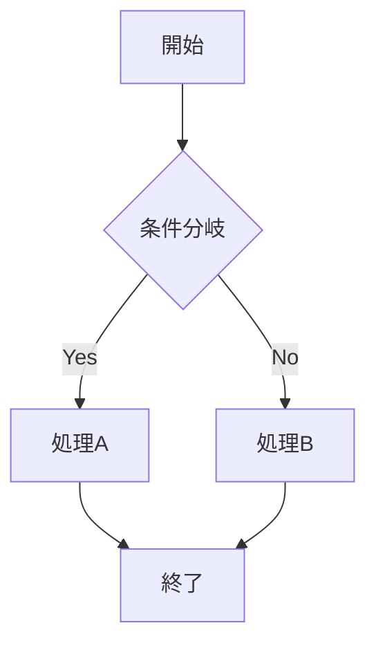
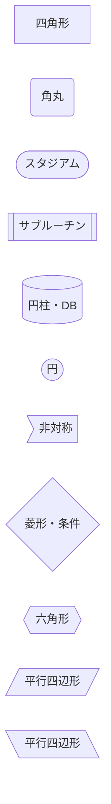
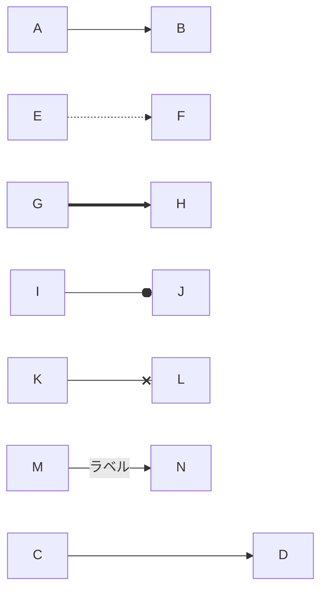
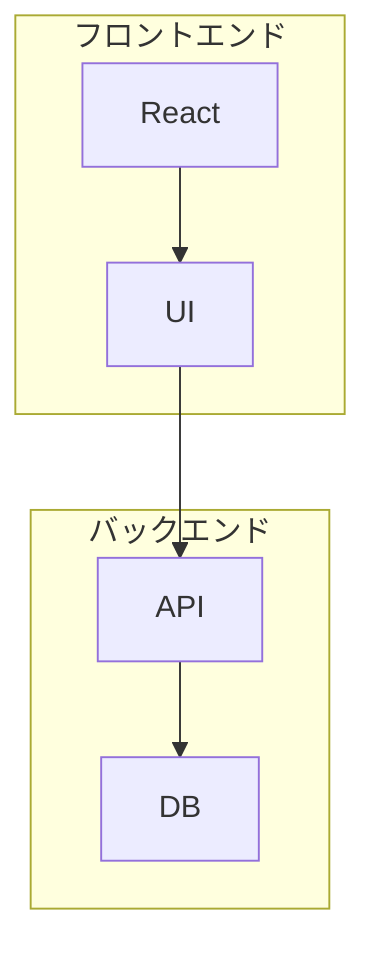
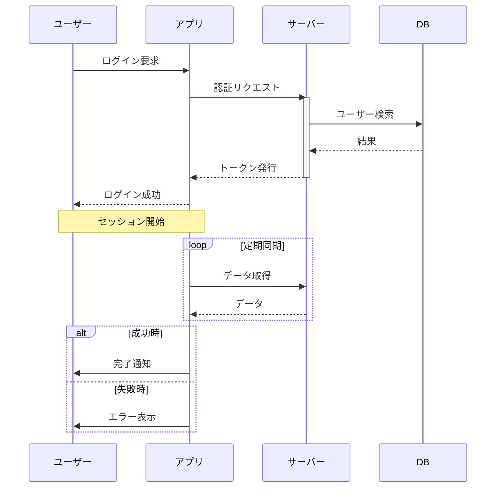
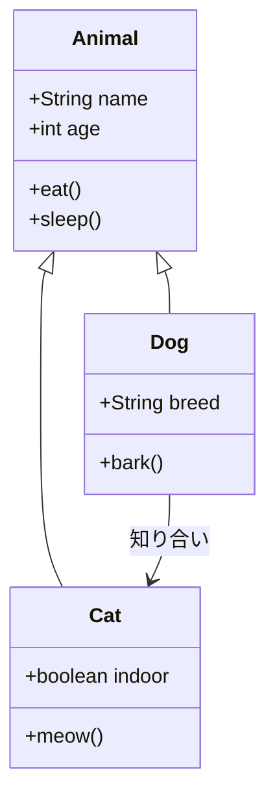
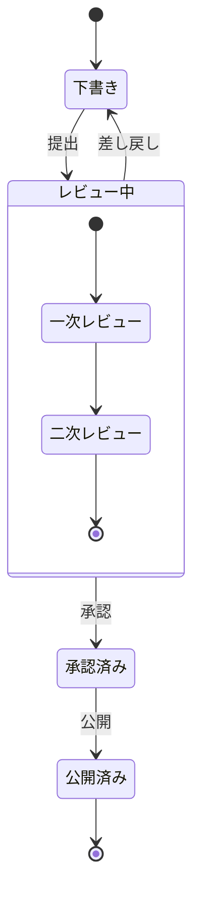
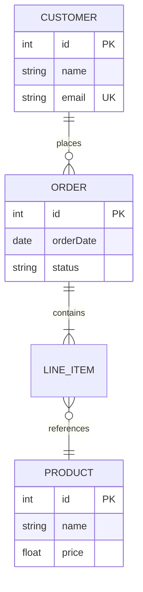
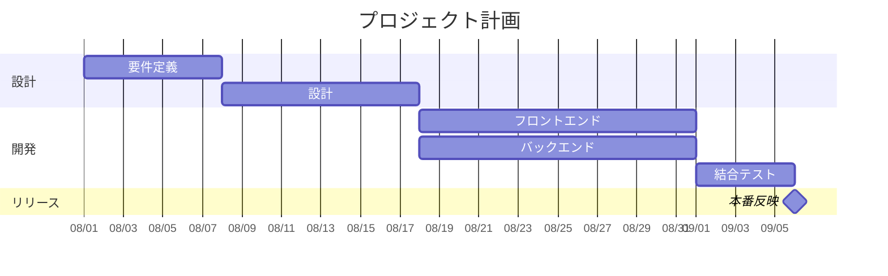
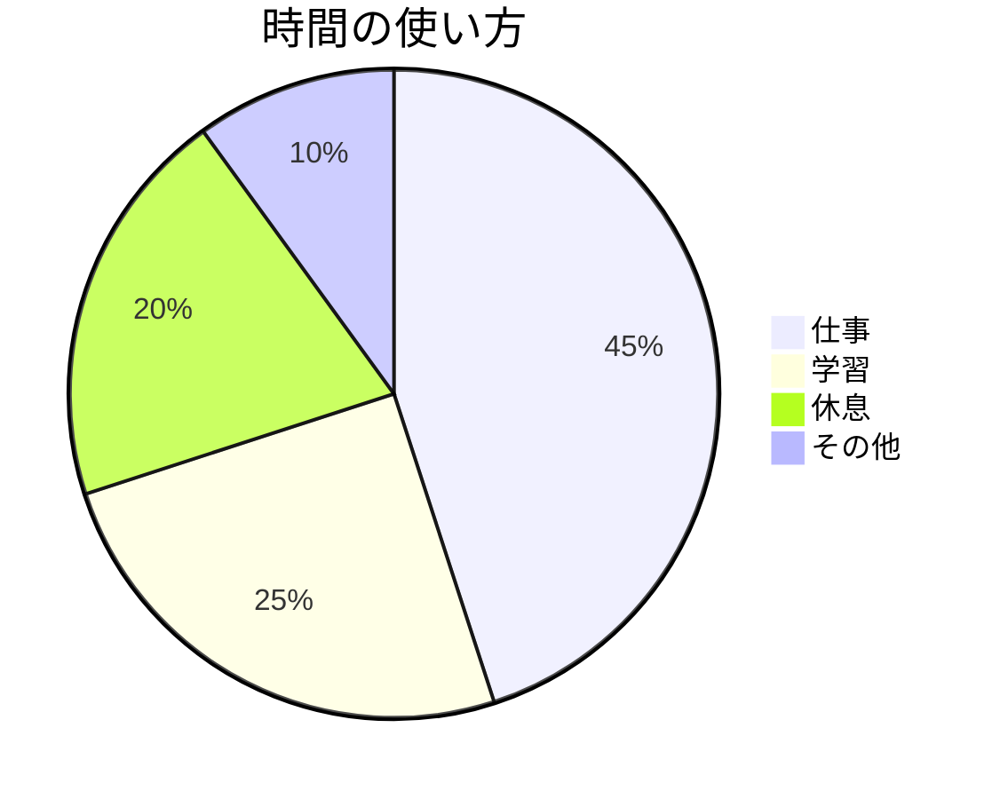

---
tags:
  - cheatsheet
  - markdown
  - obsidian
aliases:
  - Obsidian Markdown チートシート
  - マークダウン記法一覧
cssclasses:
  - wide-page
---

# Obsidian Markdown チートシート

> [!info] このノートについて
> Obsidianで使えるMarkdown記法をできるだけ網羅したリファレンスです。  
> 各項目で **書き方**（ソース）と **実際の表示**（レンダリング結果）を併記しています。  
> **Reading View** で見ると「実際の表示」が正しくレンダリングされます。

---

## 1. 基本のテキスト装飾

### 見出し（Headings）

**書き方**
````
# 見出し1
## 見出し2
### 見出し3
#### 見出し4
##### 見出し5
###### 見出し6
````

**実際の表示**
# 見出し1
## 見出し2
### 見出し3
#### 見出し4
##### 見出し5
###### 見出し6

---

### 太字・斜体・取り消し線・ハイライト

**書き方**
````
**太字** または __太字__
*斜体* または _斜体_
***太字＋斜体***
~~取り消し線~~
==ハイライト==
`インラインコード`
````

**実際の表示**

**太字** または __太字__  
*斜体* または _斜体_  
***太字＋斜体***  
~~取り消し線~~  
==ハイライト==  
`インラインコード`

---

### 水平線

**書き方**
````
---
***
___
````

**実際の表示**

---

---

## 2. リスト

### 箇条書き（Unordered）

**書き方**
````
- 項目1
- 項目2
  - ネスト項目
	  - さらにネスト
* アスタリスクも使える
+ プラスも使える
````

**実際の表示**
- 項目1
- 項目2
  - ネスト項目
	  - さらにネスト
* アスタリスクも使える
+ プラスも使える

---

### 番号付きリスト（Ordered）

**書き方**
````
1. 最初の項目
2. 次の項目
   3. ネストした番号付き
   4. もう一つ
5. 最後の項目
````

**実際の表示**
1. 最初の項目
2. 次の項目
   3. ネストした番号付き
	   1. もう一つ
4. 最後の項目

---

### タスクリスト（チェックボックス）

**書き方**
````
- [ ] 未完了タスク
- [x] 完了したタスク
- [ ] ネストも可能
  - [ ] サブタスク
````

**実際の表示**
- [ ] 未完了タスク
- [x] 完了したタスク
- [ ] ネストも可能
  - [ ] サブタスク

> Reading Viewではチェックボックスをクリックして切り替え可能。

---

## 3. リンク

### 外部リンク

**書き方**
````
[表示テキスト](https://obsidian.md)
[Obsidian公式](https://obsidian.md "ツールチップ")
````

**実際の表示**

[表示テキスト](https://obsidian.md)  
[Obsidian公式](https://obsidian.md "ツールチップ")

---

### 内部リンク（WikiLinks）★Obsidianの特徴

**書き方**
````
[[ノート名]]
[[ノート名|表示テキスト]]
[[フォルダ/ノート名]]
[[ノート名#見出し名]]
[[ノート名#見出し名|表示テキスト]]
[[ノート名#^ブロックID]]
[[#同じノート内の見出し]]
````

**実際の表示**（例）

[[ノート名]]  
[[ノート名|表示テキスト]]  
[[#1. 基本のテキスト装飾]]

> ノートが存在しない場合、クリックすると新規作成されます。

---

## 4. 埋め込み（Embeds / Transclusion）

`!` を付けるとリンクではなく**中身を展開**します。

**書き方**
````
![[ノート名]]
![[ノート名#見出し]]
![[ノート名#^ブロックID]]
![[画像.png]]
![[画像.png|300]]
![[画像.png|300x200]]
![[資料.pdf]]
![[資料.pdf#page=3]]
![[音声.mp3]]
![[動画.mp4]]
````

**実際の表示**

（実際に存在するノートや画像を指定すると展開されます）

例：このノートの見出しを埋め込む  
![[#1. 基本のテキスト装飾]]

---

## 5. 引用とコールアウト

### 普通の引用

**書き方**
````
> これは引用文です。
> 複数行も可能。
````

**実際の表示**
> これは引用文です。
> 複数行も可能。

---

### コールアウト（Callouts）★Obsidianの強力機能

**書き方（基本）**
````
> [!note]
> ここに本文を書きます。
````

**実際の表示**
> [!note]
> ここに本文を書きます。

**書き方（カスタムタイトル）**
````
> [!tip] ここにタイトル
> 本文
````

**実際の表示**
> [!tip] ここにタイトル
> 本文

**書き方（折りたたみ）**
````
> [!warning]- デフォルトで閉じる
> 中身は隠れる

> [!info]+ デフォルトで開く
> 中身が見える状態で折りたたみ可能
````

**実際の表示**
> [!warning]- デフォルトで閉じる
> 中身は隠れる

> [!info]+ デフォルトで開く
> 中身が見える状態で折りたたみ可能

#### 標準のコールアウト種類一覧

| 種類 | エイリアス | 用途の目安 |
|------|------------|------------|
| `note` | - | 一般的なメモ |
| `abstract` | `summary`, `tldr` | 要約 |
| `info` | - | 情報 |
| `todo` | - | やること |
| `tip` | `hint`, `important` | ヒント・重要 |
| `success` | `check`, `done` | 成功・完了 |
| `question` | `help`, `faq` | 質問 |
| `warning` | `caution`, `attention` | 注意 |
| `failure` | `fail`, `missing` | 失敗・不足 |
| `danger` | `error` | 危険・エラー |
| `bug` | - | バグ |
| `example` | - | 例 |
| `quote` | `cite` | 引用 |

**実際の表示（代表例）**

> [!note]
> note の例

> [!abstract]
> abstract / summary / tldr の例

> [!info]
> info の例

> [!todo]
> todo の例

> [!tip]
> tip / hint / important の例

> [!success]
> success / check / done の例

> [!question]
> question / help / faq の例

> [!warning]
> warning / caution / attention の例

> [!failure]
> failure / fail / missing の例

> [!danger]
> danger / error の例

> [!bug]
> bug の例

> [!example]
> example の例

> [!quote]
> quote / cite の例

**ネスト（書き方）**
````
> [!question] 外側
> > [!tip] 内側
> > ネストしたコールアウト
````

**ネスト（実際の表示）**
> [!question] 外側
> > [!tip] 内側
> > ネストしたコールアウト

---

## 6. コード

### インラインコード

**書き方**
````
`console.log("Hello")`
````

**実際の表示**

`console.log("Hello")`

---

### コードブロック（シンタックスハイライト付き）

**書き方**
````
```js
function hello() {
  console.log("Hello Obsidian");
}
```
````

**実際の表示**
```js
function hello() {
  console.log("Hello Obsidian");
}
```

よく使う言語指定例：`js`, `ts`, `python`, `css`, `html`, `json`, `yaml`, `bash`, `sql`, `md` など。

---

## 7. テーブル

**書き方**
````
| 左寄せ | 中央寄せ | 右寄せ |
|:-------|:--------:|-------:|
| 左     | 中央     | 右     |
| A      | B        | C      |
````

**実際の表示**

| 左寄せ | 中央寄せ | 右寄せ |
|:-------|:--------:|-------:|
| 左     | 中央     | 右     |
| A      | B        | C      |

- 区切り行に `:` を付けると揃え方が変わる
- 左右の `|` は省略可能だが、あった方が読みやすい

---

## 8. 数式（Math / LaTeX）

### インライン

**書き方**
````
アインシュタインの式 $E = mc^2$ は有名です。
````

**実際の表示**

アインシュタインの式 $E = mc^2$ は有名です。

---

### ブロック

**書き方**
````
$$
\int_0^1 x^2 \, dx = \frac{1}{3}
$$
````

**実際の表示**

$$
\int_0^1 x^2 \, dx = \frac{1}{3}
$$

---

## 9. 図（Mermaid）

ObsidianはMermaidを標準サポートしています。  
コードブロックの言語に `mermaid` を指定するだけでレンダリングされます。

> [!tip]
> 複雑な図は [Mermaid Live Editor](https://mermaid.live) で試し書きしてからコピーするのがおすすめです。

---

### 9.1 Flowchart（フローチャート）

**方向**
- `TD` / `TB` … 上から下
- `LR` … 左から右
- `RL` … 右から左
- `BT` … 下から上

**書き方**
````

````

**実際の表示**


**ノードの形（書き方）**
````

````

**ノードの形（実際の表示）**


**矢印の種類（書き方）**
````

````

**矢印の種類（実際の表示）**


**サブグラフ（書き方）**
````

````

**サブグラフ（実際の表示）**


---

### 9.2 Sequence Diagram（シーケンス図）

**書き方**
````

````

**実際の表示**


**主な記法**
- `->>` 実線矢印（同期）
- `-->>` 破線矢印（応答）
- `-x` 失敗矢印
- `activate` / `deactivate` または `+` / `-`
- `Note left of` / `Note right of` / `Note over`
- `loop` / `alt` / `else` / `opt` / `par` / `and` / `critical`

---

### 9.3 Class Diagram（クラス図）

**書き方**
````

````

**実際の表示**


**関係の記法**
- `<|--` 継承
- `*--` コンポジション
- `o--` 集約
- `-->` 関連
- `<|..` 実装（インターフェース）
- `..>` 依存

---

### 9.4 State Diagram（状態図）

**書き方**
````

````

**実際の表示**


---

### 9.5 ER Diagram（エンティティ関連図）

**書き方**
````

````

**実際の表示**


**関係の記法**
- `||--||` 1対1
- `||--o{` 1対多
- `}o--o{` 多対多

---

### 9.6 Gantt Chart（ガントチャート）

**書き方**
````

````

**実際の表示**


---

### 9.7 Pie Chart（円グラフ）

**書き方**
````

````

**実際の表示**


---

### 9.8 Mindmap（マインドマップ）

**書き方**
````
```mermaid
mindmap
  root((Obsidian))
    ノート
      Markdown
      リンク
      埋め込み
    プラグイン
      Dataview
      Templater
      Calendar
    グラフビュー
      ローカル
      グローバル
```
````

**実際の表示**
```mermaid
mindmap
  root((Obsidian))
    ノート
      Markdown
      リンク
      埋め込み
    プラグイン
      Dataview
      Templater
      Calendar
    グラフビュー
      ローカル
      グローバル
```

---

### 9.9 Timeline（タイムライン）

**書き方**
````
```mermaid
timeline
    title 技術の歴史
    section 過去
        2004 : Markdown登場
        2010 : GitHubがMarkdownを採用
    section 現在
        2020 : Obsidianリリース
        2023 : Obsidian 1.0
    section 未来
        2026 : さらなる進化
```
````

**実際の表示**
```mermaid
timeline
    title 技術の歴史
    section 過去
        2004 : Markdown登場
        2010 : GitHubがMarkdownを採用
    section 現在
        2020 : Obsidianリリース
        2023 : Obsidian 1.0
    section 未来
        2026 : さらなる進化
```

---

### 9.10 Git Graph（Gitの履歴）

**書き方**
````
```mermaid
gitGraph
    commit id: "初期コミット"
    branch develop
    checkout develop
    commit id: "機能追加"
    commit id: "バグ修正"
    checkout main
    merge develop
    commit id: "リリース v1.0"
```
````

**実際の表示**
```mermaid
gitGraph
    commit id: "初期コミット"
    branch develop
    checkout develop
    commit id: "機能追加"
    commit id: "バグ修正"
    checkout main
    merge develop
    commit id: "リリース v1.0"
```

---

### 9.11 Quadrant Chart（四象限図）

**書き方**
````
```mermaid
quadrantChart
    title 優先度マトリクス
    x-axis 緊急度が低い --> 緊急度が高い
    y-axis 重要度が低い --> 重要度が高い
    quadrant-1 すぐにやる
    quadrant-2 計画する
    quadrant-3 捨てる
    quadrant-4 委任する
    "重要なバグ": [0.8, 0.9]
    "新機能検討": [0.3, 0.7]
    "メール返信": [0.7, 0.2]
    "SNSチェック": [0.2, 0.1]
```
````

**実際の表示**
```mermaid
quadrantChart
    title 優先度マトリクス
    x-axis 緊急度が低い --> 緊急度が高い
    y-axis 重要度が低い --> 重要度が高い
    quadrant-1 すぐにやる
    quadrant-2 計画する
    quadrant-3 捨てる
    quadrant-4 委任する
    "重要なバグ": [0.8, 0.9]
    "新機能検討": [0.3, 0.7]
    "メール返信": [0.7, 0.2]
    "SNSチェック": [0.2, 0.1]
```

---

### 9.12 User Journey（ユーザージャーニー）

**書き方**
````
```mermaid
journey
    title アプリ購入までの流れ
    section 発見
      検索する: 5: ユーザー
      レビューを見る: 3: ユーザー
    section 検討
      比較する: 4: ユーザー
      値段を確認: 3: ユーザー
    section 購入
      カートに入れる: 5: ユーザー
      決済する: 4: ユーザー
```
````

**実際の表示**
```mermaid
journey
    title アプリ購入までの流れ
    section 発見
      検索する: 5: ユーザー
      レビューを見る: 3: ユーザー
    section 検討
      比較する: 4: ユーザー
      値段を確認: 3: ユーザー
    section 購入
      カートに入れる: 5: ユーザー
      決済する: 4: ユーザー
```

---

### 9.13 その他のTips

**コメント**（図には表示されない）
```
%% これはコメントです
```

**テーマの指定（一部環境で有効）**
````
```mermaid
%%{init: {'theme': 'dark'}}%%
flowchart TD
    A --> B
```
````

**Obsidianの内部リンクを図に含める**
````
```mermaid
flowchart TD
    A[ノートA] --> B[ノートB]
    class A,B internal-link;
```
````

> [!note]
> Obsidianのバージョンによって使えるMermaidのバージョンが異なります。  
> 最新の記法が動かない場合は、コミュニティプラグイン（Modern Mermaid など）の利用を検討してください。

---

## 10. タグ

**書き方**
````
#タグ
#ネスト/タグ
#プロジェクト/進行中
#status/done
````

**実際の表示**

#タグ  
#ネスト/タグ  
#プロジェクト/進行中  
#status/done

- フロントマターの `tags` プロパティでも指定可能
- 階層タグは `/` で区切る

---

## 11. ブロック参照（Block Reference）

段落の末尾に `^id` を付けると、そのブロックをリンク・埋め込みできる。

**書き方**
````
これは参照したい段落です。 ^important-point
````

**実際の表示**

これは参照したい段落です。 ^important-point

リンク：
```
[[このノート#^important-point]]
```

埋め込み：
```
![[このノート#^important-point]]
```

> ブロックIDは英数字とハイフンのみ推奨。Obsidianが自動提案してくれます。

---

## 12. 脚注（Footnotes）

**書き方**
````
これは脚注付きの文です[^1]。

[^1]: ここに脚注の内容を書きます。

インライン脚注も使えます。^[ここに直接書くことも可能]
````

**実際の表示**

これは脚注付きの文です[^1]。

[^1]: ここに脚注の内容を書きます。

インライン脚注も使えます。^[ここに直接書くことも可能]

> Reading Viewでのみ番号付きで表示されます。

---

## 13. コメント（非表示テキスト）

編集時だけ見えるコメント：

**書き方**
````
表示されるテキスト %%ここは編集時のみ見える%% また表示されるテキスト

%%
複数行の
コメントも
書けます
%%
````

**実際の表示**

表示されるテキスト %%ここは編集時のみ見える%% また表示されるテキスト

%%
複数行の
コメントも
書けます
%%

> Reading ViewやPublishでは完全に非表示になります。

---

## 14. プロパティ（Frontmatter / YAML）

ノートの先頭に書く：

**書き方**
````
---
title: ノートのタイトル
date: 2026-08-10
tags:
  - project
  - active
aliases:
  - 別名1
  - 別名2
status: in-progress
priority: high
cssclasses:
  - wide-page
---
````

**実際の表示**

このノートの先頭に書かれているものがその例です（Propertiesパネルで確認できます）。

よく使うプロパティ：
- `tags` … タグ
- `aliases` … 別名（リンク時に使える）
- `cssclasses` … ノート専用のCSSクラス
- その他、自由にカスタムプロパティを追加可能

---

## 15. その他便利な記法

### HTMLの一部使用

**書き方**
````
<div style="color: red;">赤い文字</div>
<details>
<summary>クリックで開く</summary>
隠していた内容
</details>
````

**実際の表示**

<div style="color: red;">赤い文字</div>
<details>
<summary>クリックで開く</summary>
隠していた内容
</details>

> セキュリティのため、一部のHTMLはサニタイズされます。

---

### エスケープ

特殊文字をそのまま表示したい場合は `\` を付ける：

**書き方**
````
\*これは斜体にならない\*
\# これは見出しにならない
````

**実際の表示**

\*これは斜体にならない\*  
\# これは見出しにならない

---

## クイックリファレンス（よく使うもの）

| やりたいこと | 記法 |
|--------------|------|
| 太字 | `**太字**` |
| ハイライト | `==ハイライト==` |
| 内部リンク | `[[ノート名]]` |
| 埋め込み | `![[ノート名]]` |
| コールアウト | `> [!note]` |
| タスク | `- [ ] タスク` |
| タグ | `#タグ` |
| 数式 | `$数式$` / `$$数式$$` |
| コメント | `%%コメント%%` |
| 画像サイズ指定 | `![[画像.png\|300]]` |

---

## 補足

- Obsidianは **CommonMark + GitHub Flavored Markdown + 独自拡張** を採用しています。
- WikiLinks・埋め込み・コールアウト・ブロック参照などは **Obsidian専用** の記法です。他のMarkdownエディタではそのまま動きません。
- 設定の「ファイルとリンク」で WikiLinks のオン/オフを切り替え可能です。

> [!tip] おすすめ
> このノート自体を「Obsidian Markdown チートシート」として保存し、クイックスイッチャー（`Ctrl/Cmd + O`）でいつでも呼び出せるようにしておくと便利です。
