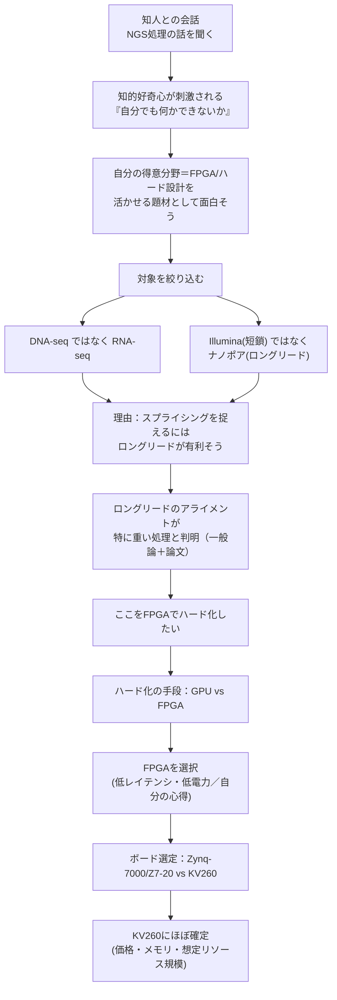
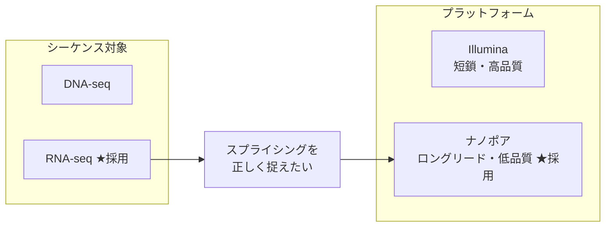
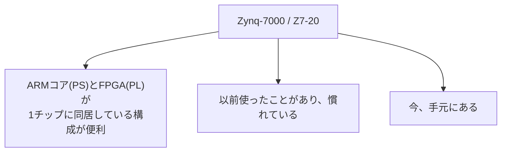

# NGS Hard Acceleration 構想メモ

> [!note] このノートについて
> 知人との会話がきっかけで始まった、完全に趣味・知的好奇心ベースの研究構想。
> [[研究/NGS/index|NGS研究区画]] のスタート地点であり、このノート自体も
> 検討が進むごとに更新していく「生きているメモ」。

---

## 🗺️ 思考の流れ（現時点）

---

## 1. きっかけと動機

> [!info] なぜこの研究を始めたのか
> 知人と話したことがきっかけで、NGS（次世代シーケンサ）のハードウェアアクセラレーションに興味を持った。
> そこから先は完全に自分の趣味・知的欲求に基づく研究として続けている。
> 「既存ソフトウェアが遅い／コストが高い」という不満が出発点だったわけではなく、
> **知的好奇心 → 自分の得意分野（FPGA）を活かせそうという直感** が先にあった。

動機を強さの順に並べると、今のところこんな感じ：

1. **FPGA/ハード設計の技術的興味**（一番大きい）
2. **知的好奇心そのもの・趣味としての研究**（同じくらい大きい）
3. 既存ソフトウェア（アライメントツール等）の速度・コストへの不満（次点、まだ実感としては弱い）

「困っているから解決したい」ではなく「面白そうだからやってみたい」が先に立っている、ということ。この順番は対象選定・ボード選定の判断基準にも効いてくる（速さより「自分が触っていて楽しいか」を優先しがちになる、という自覚）。

---

## 2. 対象の絞り込み：DNA-seqではなくRNA-seq、Illuminaではなくナノポア

最初は漠然と「NGS処理」としていたが、思考を進める中で対象がかなり具体的に絞れてきた。

> [!important] なぜRNA-seq × ナノポア（ロングリード）なのか
> **スプライシングの解析を考えると、ロングリードの方が有利**という判断。
> ナノポアは1リードあたりの品質はIllumina（短鎖）より低いが、
> エクソン構造をまたいで1本のリードで読み切れることがスプライシング検出において強みになる、という理解。
>
> この判断は今のところ一般論＋論文で読んだ知識ベースで、自分で実際にデータを触って確かめたわけではない
> （要検証：具体的にどの論文・どんな比較だったかを [[参考文献・論文メモ_概要|参考文献・論文メモ]] に残しておきたい）。

---

## 3. ボトルネック：ロングリードのアライメントが重い

NGS解析パイプライン全体で見ると、狙っているのは以下の工程。

> [!warning] アライメントが重いという実感の根拠
> 「ロングリードのアライメントは計算コストが高い」というのは、今のところ**一般論としての認識**と
> **論文で読んだ内容**がベース。自分で実際にツール（minimap2等）を動かして計測したわけではない。
> → 次のアクション：実際に手元でロングリードアライメントを走らせて、どこにどれくらい時間がかかっているか
> 自分の目で確認する（[[ベンチマーク・性能検証_概要|ベンチマーク・性能検証]] でやる）。

なぜ重くなりやすいか、現時点での理解（ラフな仮説）：
- ロングリード（数kb〜）× 低品質（エラー率が高い）の組み合わせで、Smith-Waterman的な厳密なアラインメントをまともにやると計算量が跳ね上がる
- 実用ツールはシード＆エクステンド方式などでヒューリスティックに高速化しているが、それでもリード長が長い分、絶対的な計算量は短鎖リードより大きくなりやすい

この理解が正しいかどうかは検証が必要（[[アルゴリズム・パイプライン設計_概要|アルゴリズム・パイプライン設計]] で深掘り）。

---

## 4. なぜGPUでなくFPGAなのか

比較の軸はシンプルに2つだった。

| 観点 | GPU | FPGA |
|---|---|---|
| レイテンシ・電力 | 汎用コアの並列実行 | 固定機能回路に落とせるので低レイテンシ・低電力が狙える |
| 自分のスキルとの相性 | 経験なし | 多少の心得あり（練度は高くない） |

> [!important] 結論：FPGAを選んだ理由
> 1. **固定機能回路に落とし込むことで、低レイテンシ・低電力を狙える**という技術的な期待
> 2. **自分がFPGAに多少の心得がある**こと。GPUは未経験だが、話を聞いた感触からもFPGAの方が今回の処理には合っていそうと判断した
>
> スキルの「練度」自体はまだ高くない、というのは正直な自己評価。だからこそ研究として面白い、とも言える。

---

## 5. ボード選定：Zynq-7000/Z7-20 → KV260へ（ほぼ確定）

### 5.1 最初はZynq-7000 / Z7-20が第一候補だった

PS（Processing System＝ARMコア）側でLinuxや制御処理を回し、PL（Programmable Logic）側で重い並列処理をやらせる、という役割分担がやりやすいのが魅力。加えて「慣れている」「手元にある」という即着手できる強さも大きかった。

### 5.2 KV260に乗り換え、ほぼ確定

> [!important] 現時点の結論：KV260に十中八九する
> 対象がRNA-seq×ナノポアのロングリードアライメントに絞り込まれたことで、判断材料が変わった。
>
> - **価格・メモリ容量が決め手**：KV260は安く、メモリも大きいらしい
> - **リソース規模の見立て**：ロングリードアライメントを回路に落とすなら、Z7-20のLUT/BRAM規模では不足しそう、という判断
>
> Z7-20は「慣れている・手元にある」という着手のしやすさでは魅力的だったが、
> **処理内容（ロングリード×アライメント）の要求リソースを考えるとKV260の方が現実的**、という結論に至った。

| 観点 | Zynq-7000 / Z7-20 | KV260 |
|---|---|---|
| 使用経験 | あり（慣れている） | なし |
| 入手性 | 手元にある | 別途入手が必要 |
| 価格 | ― | 安い（らしい） |
| メモリ容量 | 相対的に小さい | 大きい（らしい） |
| ロングリードアライメント向けリソース規模 | 不足しそう | より現実的 |

> [!todo] 検証が必要
> 「安い」「メモリが大きい」は今のところ伝聞ベース。実際のスペックシート・価格・入手性を確認し、
> Z7-20との定量的な比較表を作る（[[FPGA実装_概要|FPGA実装]] 側で実施予定）。

---

## 6. 現時点でのTODO

- [ ] KV260の正式スペック・価格・入手性を確認し、Z7-20との比較表を確定させる → [[FPGA実装_概要|FPGA実装]]
- [ ] ロングリードアライメントの計算構造を整理し、回路化しやすい処理単位に分解する → [[アルゴリズム・パイプライン設計_概要|アルゴリズム・パイプライン設計]]
- [ ] 実際にminimap2等でナノポアのロングリードアライメントを動かし、ボトルネックを自分の目で確認する → [[ベンチマーク・性能検証_概要|ベンチマーク・性能検証]]
- [ ] 「ロングリードがスプライシング検出に有利」の根拠論文を探して要約する → [[参考文献・論文メモ_概要|参考文献・論文メモ]]
- [ ] 「ロングリードアライメントが重い」の根拠論文を探して要約する → [[参考文献・論文メモ_概要|参考文献・論文メモ]]
- [ ] バイオインフォマティクスの基礎知識を対話形式で積み上げる → [[基礎学習_概要|基礎学習]]

---

## 関連ノート

- [[研究/NGS/index|NGS研究区画インデックス]]
- [[基礎学習_概要|基礎学習]]
- [[アルゴリズム・パイプライン設計_概要|アルゴリズム・パイプライン設計]]
- [[FPGA実装_概要|FPGA実装]]
- [[ベンチマーク・性能検証_概要|ベンチマーク・性能検証]]
- [[参考文献・論文メモ_概要|参考文献・論文メモ]]
