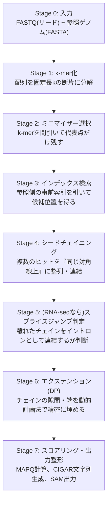
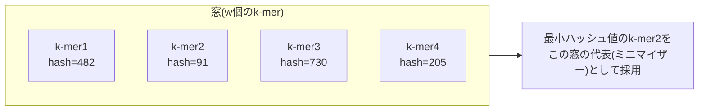

# k-merとミニマイザー

> [!note] 位置づけ
> [[06_アライメント_概要|06_アライメント]] の内部ステージの一つ。[[06.2_シード探索とエクステンド|シード探索とエクステンド]] の「① シード探索」をさらに分解した、FASTQ→アライメントの最初期段階。
> 「ハッシュ化してミニマイズして検索して並べる」という大枠理解を、段階ごとに厳密化するためのノート。
> [[NGS Hard Acceleration]] のFPGA実装で最も回路化しやすい部分と目されている。

---

## FASTQ→アライメントの全体ステージ



このノートは **Stage 1・2** を扱う（Stage 3以降は別ノートで深掘り予定）。

---

## Stage 1: k-mer化

配列を固定長 $k$ の窓でスライドさせながら切り出す。長さ $L$ のリードから $L-k+1$ 個のk-merが得られる。

```
リード: ACGTACGGTTCAGGCTAGCATGCA...
k-mer1: ACGTACGGTTCAGGC (位置0)
k-mer2:  CGTACGGTTCAGGCT (位置1)
k-mer3:   GTACGGTTCAGGCTA (位置2)
...
```

隣接するk-merはほぼ内容が重複する **スライディングウィンドウ**。参照ゲノム側もインデックス構築時に同じ処理を事前に行っておく。

---

## Stage 2: ミニマイザー選択（なぜ間引くのか）

k-merを全部保持すると索引が肥大化する（参照ゲノム側で30億個規模）。そこで窓ごとに1個だけ代表を残す。

### 定義

$$\text{minimizer}(\text{窓}) = \arg\min_{i \in \text{窓内}} h(k\text{-mer}_i)$$

$h(\cdot)$ はk-mer文字列を整数にマッピングするハッシュ関数（詳細は次節）。



### なぜ検索漏れが少ないまま間引けるか

窓を1つずらしても、選ばれるミニマイザーは「変わらない」か「隣の窓と共有される」ことが多く、リード全体で見るとユニークなミニマイザー数は元のk-mer数よりずっと少なくなる（目安：窓幅 $w$ に対しおよそ $2/(w+1)$ 程度の密度）。

> [!tip] 回路屋的直感
> 「ローパスフィルタで信号を間引く（ダウンサンプリング）」に近いが、**単純な等間隔サンプリングではなく、
> 局所的な最小値を基準にした適応的サンプリング**。これにより、リードにわずかな挿入欠失があっても
> 窓の位置がずれるだけで同じミニマイザーが選ばれ続けやすい（＝ロバスト性が高い）。

参照ゲノム側も同じ処理を行い、`ミニマイザーのハッシュ値 → ゲノム上の位置(染色体+座標)のリスト` という索引を事前構築しておく（Stage 3で引く対象）。

---

## ハッシュ関数 $h(\cdot)$ の中身

### ① 2bitエンコード：塩基配列を整数化

ATGCの4文字は2bitで表現できる。

$$A=00,\ C=01,\ G=10,\ T=11$$

k-mer（長さ $k$）は $2k$ bitの整数として表現できる。例：`k=4` の `ACGT` は

$$\text{ACGT} \rightarrow 00\ 01\ 10\ 11 \rightarrow 0001\,1011_2 = 27$$

スライディングウィンドウでk-merを1個進めるときは、古い塩基2bitを追い出し新しい塩基2bitを詰めるだけで済む。

$$\text{kmer}_{i+1} = ((\text{kmer}_i \ll 2) \,|\, \text{new\_base}) \,\&\, (2^{2k}-1)$$

> [!tip] 回路屋的直感
> 「4値シンボル列を2bit幅のシフトレジスタに詰め込む」だけの軽量処理。ビットシフト＋マスク＋ORのみで、回路化しやすい典型例。

### ② 逆鎖（相補鎖）の正規化

DNAは二重らせんで、シーケンサがどちら鎖を読んでいるか分からない。各k-merについて、元の配列と**逆相補配列**（A↔T, G↔C を入れ替えて逆順にしたもの）の両方を計算し、2bit整数として**小さい方**を採用する。これにより「どちら向きに読んでも同じハッシュ値になる」正規化ができる。

### ③ ビット混合（bit-mixing）ハッシュ：なぜ生の2bit値を使わないか

生の2bit整数値をそのままキーにすると、ATGC配列の生物学的な偏り（繰り返し配列、GC含量の偏り）でハッシュテーブル上の分布が偏る。そこでビット混合ハッシュで疑似ランダムに分散させる。

典型例（invertible hash、擬似コード）：

```
hash(x):
    x = (~x + (x << 21)) & mask
    x = x ^ (x >> 24)
    x = (x + (x << 3) + (x << 8)) & mask
    x = x ^ (x >> 14)
    x = (x + (x << 2) + (x << 4)) & mask
    x = x ^ (x >> 28)
    x = (x + (x << 31)) & mask
    return x
```

シフト・XOR・加算のみで構成され、乗算器・除算器を使わない軽量なハッシュ。

> [!important] FPGA実装への含意
> - k-merの更新（スライディングウィンドウ）：シフト+マスクの組み合わせ論理、1サイクルで可能
> - ハッシュ計算：シフト・XOR・加算のみの多段パイプライン。乗算器不要でLUT消費も少なく済みそう
> - **Stage 1〜2（k-mer化＋ミニマイザー選択）はソフトウェアより回路の方が本質的に得意な処理**と言える
> - 対してStage 3のインデックス検索（ハッシュテーブル引き）は**メモリアクセス律速**になるため、
>   FPGA化の効果はメモリ帯域・BRAM容量の設計に強く依存する（[[FPGA実装_概要|FPGA実装]]で詳細検討）

### ミニマイザー選択との接続

ハッシュ関数が疑似ランダムに分散していることで、Stage 2の「窓内最小値選択」が特定の配列パターンに偏らず、統計的に均等にk-merを間引ける。生の2bit値のまま最小値を取ると、単純な配列（例：`AAAA...`）ばかりが選ばれる偏りが出てしまう。

---

## 未消化・要復習

- [ ] Stage 3：参照ゲノム側の索引（ハッシュテーブル）の実際のデータ構造とルックアップ方法
- [ ] Stage 4：シードチェイニング（複数ヒットを対角線上に整列・連結する具体的アルゴリズム）
- [ ] 実際のk・w（窓幅）のパラメータ値の目安（minimap2のデフォルト値など）

## 関連ノート
- [[06_アライメント_概要|06_アライメント]]
- [[06.2_シード探索とエクステンド|シード探索とエクステンド]]
- [[バイオインフォ入門]]
- [[NGS Hard Acceleration]]
- [[FPGA実装_概要|FPGA実装]]
