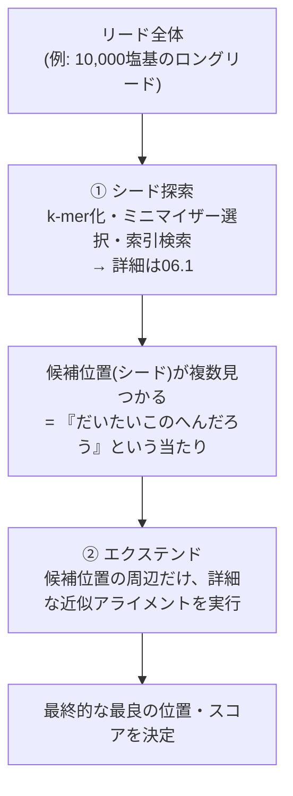

# シード探索とエクステンド（全体戦略）

> [!note] 位置づけ
> [[06_アライメント_概要|06_アライメント]] の内部ステージの一つ。⑥アライメント工程全体の設計思想（minimap2など実用ツールの基本戦略）。
> k-mer化・ミニマイザーの詳細は [[06.1_k-merとミニマイザー|06.1 k-merとミニマイザー]] に切り出し済み。
> このノートでは「なぜ2段構えが必要か」という全体戦略と、②エクステンド（DP照合）の位置づけを扱う。
> [[NGS Hard Acceleration]] でハード化を狙っている処理そのもの。

---

## なぜ必要か：力任せ探索では破綻する

リード（数百bp〜数十kb）を参照ゲノム（ヒトで約30億bp）の**あらゆる開始位置**に対して素朴に1文字ずつ比較すると、計算量が「リード長 × ゲノム長」のオーダーになり非現実的。

> [!tip] 回路屋的直感
> 「巨大なROM（30億エントリ）の中から、入力パターンに**近似一致**する場所を探す検索」に近い。
> しかもシーケンサ自体にエラー率があるため、完全一致ではなくミスマッチ・挿入・欠失を許容する必要がある。

---

## 2段構えの戦略（全体像）

### ① シード探索：広く浅く高速に候補を絞る
- リードを **k-mer** に分解し、間引いた **minimizer** で参照ゲノムの索引を検索する
- 性質：**メモリアクセス律速**（ハッシュテーブル/索引の参照が支配的）
- 詳細（k-mer化・ハッシュ関数の中身）は → [[06.1_k-merとミニマイザー|k-merとミニマイザー]]

### ② エクステンド：狭く深く精密に確認する
- シードで見つかった候補位置の周辺だけを対象に、**Smith-Waterman型の動的計画法（DP）** で精密照合する
- ミスマッチ・挿入・欠失を許容しながら最適なアライメントスコアを計算する
- 性質：**計算律速**（DPの演算量が支配的）。ただし対象範囲はシードで絞り込まれているので現実的な計算量に収まる
- DPの具体的な漸化式・スコアリングはまだ未学習（次回以降、別ノートに切り出し予定）

> [!important] ハード化における重要な含意
> シード探索とエクステンドは**性質が全く異なる処理**。
> - シード探索 = メモリ律速のルックアップ（索引アクセスがボトルネック）
> - エクステンド = 演算律速のDP（積和演算的な繰り返しがボトルネック）
>
> → FPGAで高速化するなら、**両者を別々に最適化する設計**が必要になりそう。
> 例えば索引アクセスはオンチップBRAM/外部メモリ帯域の設計問題、エクステンドは
> パイプライン化したDP回路（ドット行列を斜めに流す等）の設計問題、という切り分けになる見込み。
> → 詳細な回路設計は [[FPGA実装_概要|FPGA実装]] 側で検討する。

---

## 用語まとめ

| 用語 | 意味 |
|---|---|
| シード | k-mer一致から得られる「だいたいこの辺り」という候補位置 |
| エクステンド | シードを起点に、挿入・欠失・ミスマッチを許容しながら精密に伸長・スコアリングする処理 |
| Smith-Waterman | 局所的な最適アライメントを求める動的計画法アルゴリズム（エクステンドの中核） |

k-mer・minimizer・インデックスの用語は → [[06.1_k-merとミニマイザー|k-merとミニマイザー]] を参照。

---

## 未消化・要復習

- [ ] Smith-Waterman型DPの具体的な漸化式・スコアリング方式（マッチ/ミスマッチ/ギャップペナルティ）
- [ ] 実際のインデックスサイズ・メモリ帯域の具体的な数字感

## 関連ノート
- [[06_アライメント_概要|06_アライメント]]
- [[バイオインフォ入門]]
- [[06.1_k-merとミニマイザー|k-merとミニマイザー]]
- [[06.3_スプライシングアライメント|スプライシングアライメント]]
- [[NGS Hard Acceleration]]
- [[FPGA実装_概要|FPGA実装]]
