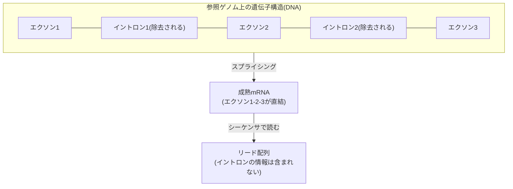
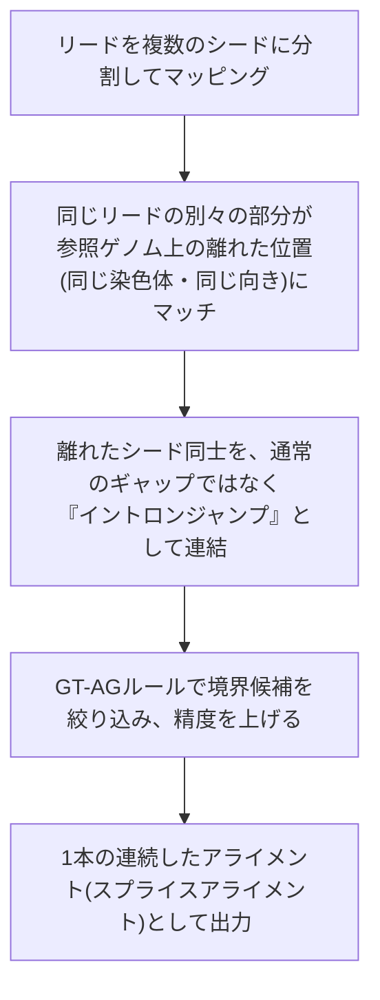

# スプライシングアライメント

> [!note] 位置づけ
> [[06_アライメント/index|06_アライメント]] の内部ステージの一つ。⑥アライメント工程のうち、**RNA-seq特有**の難しさ。
> [[06.2_シード探索とエクステンド|シード探索とエクステンド]] だけでは扱えない「大きなジャンプ」を扱うための拡張。
> [[NGS Hard Acceleration]] が対象とするナノポアRNA-seqでは、これがロングリード特有の強み（1リードで複数エクソンをまたげる）にも直結する重要な論点。

---

## なぜ問題になるのか：イントロンはリードに存在しない

DNA上の遺伝子は、実際にタンパク質の情報になる**エクソン**と、間に挟まる**イントロン**から構成される。
RNAは転写後に「スプライシング」という編集を受け、イントロンが切り取られてエクソン同士が直結される。

**シーケンサが読むリードには、そもそもイントロンの配列が存在しない。** これを参照ゲノム（DNA、イントロン込み）にそのまま位置合わせしようとすると、リード途中で参照と一致しなくなる箇所が生じる。

> [!tip] 回路屋的直感
> 通常のDNA-seqアライメントは「小さなミスマッチ・小さな挿入欠失」を許容すれば連続的にマッチする。
> RNA-seqでは、リード途中に**参照ゲノム上で数百〜数万塩基もジャンプする「大きな空白」**が必要になる。
> 「信号の一部が丸ごと欠落しているが、欠落する長さも位置も可変」という状況で、通常のギャップペナルティ付きDPの延長では効率が悪すぎる。

---

## 解決策：スプライスアウェア・アライメント

1. リードを複数のシードに分割してマッピングする（[[06.2_シード探索とエクステンド|シード探索とエクステンド]] の基本戦略の延長）
2. 「同じリードの別々の部分が、参照ゲノム上の離れた位置（だが同じ染色体・同じ向き）にマッチする」ことを検出する
3. その離れたシード同士を、**イントロンジャンプ**として繋ぎ合わせる（通常の挿入欠失とは別枠で扱う）
4. 実際のスプライシングには「イントロンはGTで始まりAGで終わる」という生物学的ルール（**GT-AGルール**）があり、ジャンプ境界の候補をこのシグナルで絞り込んで精度を上げる

> [!important] ロングリードとの関係（研究テーマとの接続）
> ナノポアのロングリードは1リードで数kb〜数十kbを読めるため、**1本のリードだけで複数のエクソン境界をまたいで読み切れる**ことが多い。
> これがまさに [[NGS Hard Acceleration]] で「スプライシング解析にはロングリードが有利」と判断した根拠部分。
> 短鎖リード（Illumina）では1リードが1エクソン内に収まりがちで、スプライシングパターンの推定は複数リードの断片的な証拠を統計的に積み上げる必要があるが、
> ロングリードなら1本で直接的に構造を観測できる可能性がある。

---

## 用語まとめ

| 用語 | 意味 |
|---|---|
| エクソン | 遺伝子のうち、成熟mRNAに残る（タンパク質情報になる）領域 |
| イントロン | 遺伝子のうち、スプライシングで除去される領域 |
| スプライシング | イントロンを除去してエクソンを直結する、RNAの編集プロセス |
| スプライスアウェア・アライメント | イントロンジャンプを考慮したアライメント手法。minimap2などが対応 |
| GT-AGルール | イントロンがGTで始まりAGで終わるという生物学的な境界ルール。境界候補の絞り込みに使われる |

---

## 未消化・要復習

- [ ] GT-AGルール以外の境界推定シグナル（既知アノテーションの利用など）
- [ ] スプライスアライメントの具体的なスコアリング方式（イントロンジャンプのペナルティ設計）
- [ ] ハード化する場合、イントロンジャンプの検出・連結処理をどう回路に落とすか（[[FPGA実装/index|FPGA実装]] 側の検討事項）

## 関連ノート
- [[06_アライメント/index|06_アライメント]]
- [[バイオインフォ入門]]
- [[06.2_シード探索とエクステンド|シード探索とエクステンド]]
- [[NGS Hard Acceleration]]
