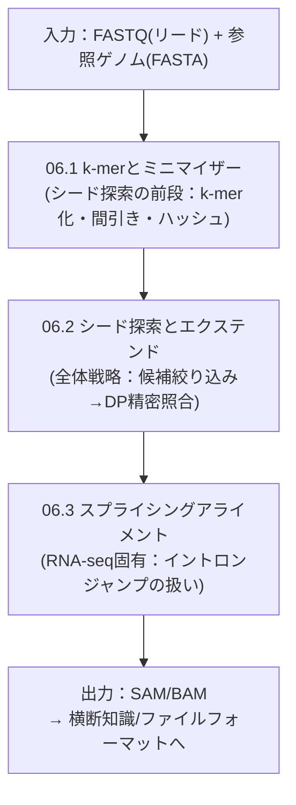

# ⑥ アライメント

> [!important] 研究ターゲット
> [[バイオインフォ入門]] の①〜⑧のうち、[[NGS Hard Acceleration]] が実際にハード化を狙っている工程。
> この章だけ内部ステージが複数あるため、`06.1`, `06.2`, `06.3` として細分化している。

## この章でやっていること

巨大な参照ゲノム（ヒトで約30億塩基）の中から、リード配列が最も一致する位置を探し出す処理。
力任せの完全一致検索では計算量が破綻するため、実用ツール（minimap2等）は「大まかに絞ってから精密照合する」戦略を取る。

## 内部ノート一覧

| 番号 | ノート | 内容 |
|---|---|---|
| 06.1 | [[06.1_k-merとミニマイザー\|k-merとミニマイザー]] | シード探索の前段。k-mer化、ミニマイザー間引き、ビット混合ハッシュの中身 |
| 06.2 | [[06.2_シード探索とエクステンド\|シード探索とエクステンド]] | アライメントの全体戦略（シード探索＋DP照合の2段構え） |
| 06.3 | [[06.3_スプライシングアライメント\|スプライシングアライメント]] | RNA-seq特有の難しさ（イントロン抜け落ち問題） |

## 未整備の内部トピック（今後追加予定）
- インデックス検索・シードチェイニングの詳細（06.2で触れているが未展開）
- Smith-Waterman型DPの漸化式・スコアリングの詳細

## 関連
- [[バイオインフォ入門]]
- [[シーケンス順ノート]]
- [[NGS Hard Acceleration]]
- [[アルゴリズム・パイプライン設計]]
- [[FPGA実装]]
