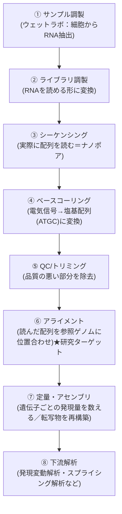
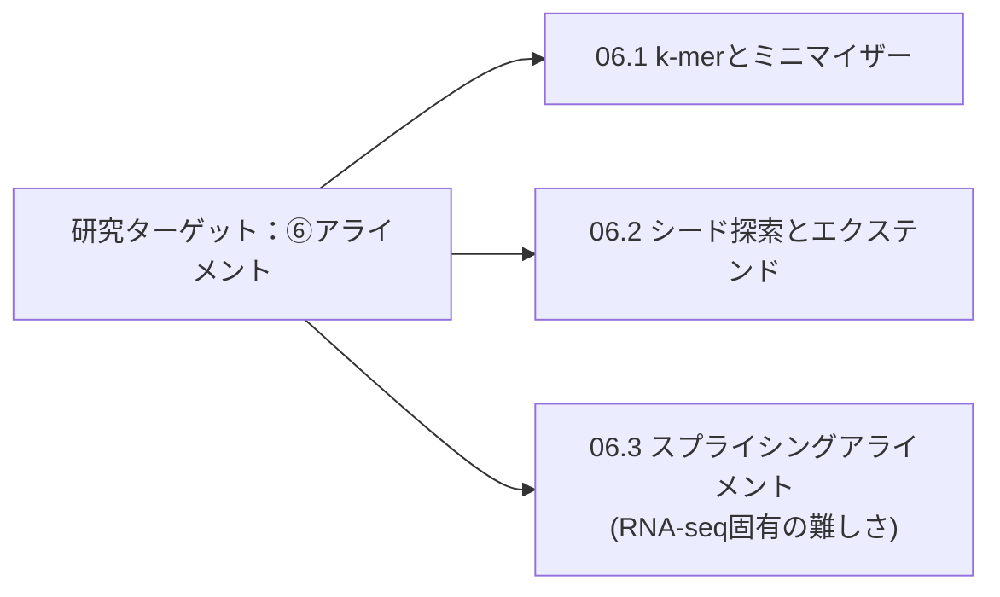

# バイオインフォ入門（全体像のハブ）

> [!note] 立ち位置
> 普段は回路設計が専門で、バイオインフォマティクスはゼロからのスタート。
> ここではまず「全体の地図」を持ち、各工程の詳細は [[シーケンス順ノート]] 配下の①〜⑧の章フォルダに、
> 特定のステージに属さない知識は [[横断知識]] に分けて1トピックずつ深掘りしていく。

---

## RNA-seq解析の全体パイプライン

### 章ノートへのリンク（図の番号 = 章フォルダの番号）

| # | 工程 | 章ノート | 状況 |
|---|---|---|---|
| ① | サンプル調製 | [[01_サンプル調製]] | 未学習 |
| ② | ライブラリ調製 | [[02_ライブラリ調製]] | 未学習 |
| ③ | シーケンシング | [[03_シーケンシング]] | 未学習 |
| ④ | ベースコーリング | [[04_ベースコーリング]] | 未学習 |
| ⑤ | QC/トリミング | [[05_QCトリミング]] | 未学習 |
| ⑥ | アライメント（★研究ターゲット） | [[06_アライメント]] | 学習中 |
| ⑦ | 定量・アセンブリ | [[07_定量アセンブリ]] | 未学習 |
| ⑧ | 下流解析 | [[08_下流解析]] | 未学習 |

---

## 回路屋アナロジー対応表

| 工程 | やっていること | 回路・信号処理での近い概念 |
|---|---|---|
| ①〜③ サンプル調製〜シーケンシング | 生体分子からデータを取得する | アナログセンサでの信号取得 |
| ④ ベースコーリング | 電流波形 → 塩基配列(ATGC)への変換 | ADC（アナログ→デジタル変換）。実際ナノポアはニューラルネットで電流波形をデコードしている |
| ⑤ QC/トリミング | 品質の悪い読み取り部分を除去 | ノイズ除去・前処理フィルタ |
| ⑥ アライメント | 巨大な参照データの中から一致箇所を探す | 大規模な近似パターンマッチング（詳細は [[06_アライメント]]） |
| ⑦⑧ 定量・下流解析 | 位置情報から意味のある統計量を出す | 後段のデータ集計・信号の意味づけ |

---

## 研究ターゲットの位置づけ

[[NGS Hard Acceleration]] で扱っているのは、上記のうち **⑥アライメント** 工程。
特に対象がナノポア（ロングリード）のRNA-seqであることから、[[06_アライメント]] の中でも以下の技術要素が重なっている。

- **シード探索とエクステンド** — アライメントの基本戦略そのもの → [[06.2_シード探索とエクステンド|シード探索とエクステンド]]
  - さらにシード探索の中身（k-mer化・ミニマイザー） → [[06.1_k-merとミニマイザー|k-merとミニマイザー]]
- **スプライシングアライメント** — RNA-seq特有の難しさ（イントロンがリード中で抜け落ちる問題）→ [[06.3_スプライシングアライメント|スプライシングアライメント]]

---

## 学習ログ（進捗トラッキング）

- [x] 全体パイプラインの俯瞰（①〜⑧）
- [ ] ① サンプル調製
- [ ] ② ライブラリ調製
- [ ] ③ シーケンシング
- [ ] ④ ベースコーリング（ナノポア特有の仕組み）
- [ ] ⑤ QC/トリミング
- [x] ⑥ アライメント
  - [x] 06.1 k-mer化・ミニマイザー選択・ハッシュ関数の中身 → [[06.1_k-merとミニマイザー|k-merとミニマイザー]]
  - [x] 06.2 シード探索とエクステンドの全体戦略 → [[06.2_シード探索とエクステンド|シード探索とエクステンド]]
  - [ ] 06.2 Smith-Waterman型DPの詳細（漸化式・スコアリング）
  - [ ] インデックス検索・シードチェイニングの詳細
  - [x] 06.3 スプライシングアライメント（イントロン抜け落ち問題）→ [[06.3_スプライシングアライメント|スプライシングアライメント]]
- [ ] ⑦ 定量・アセンブリ（リード数→発現量への変換）
- [ ] ⑧ 下流解析
- [x] 横断知識：FASTQ/SAM/BAM等のファイルフォーマット、Phredスコア、FLAG/MAPQ/CIGAR → [[ファイルフォーマット（FASTQ・SAM・BAM）]]

## 関連ノート
- [[基礎学習]]
- [[シーケンス順ノート]]
- [[横断知識]]
- [[NGS Hard Acceleration]]
- [[アルゴリズム・パイプライン設計]]
