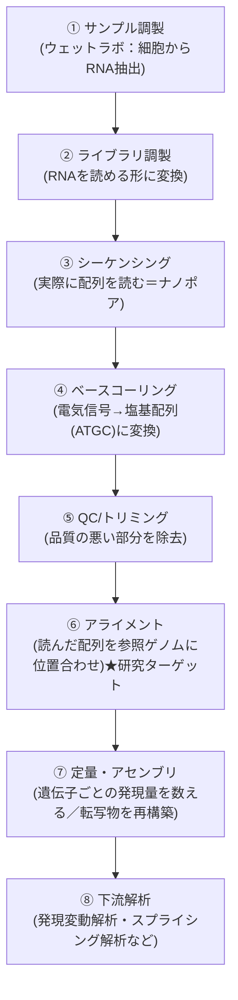
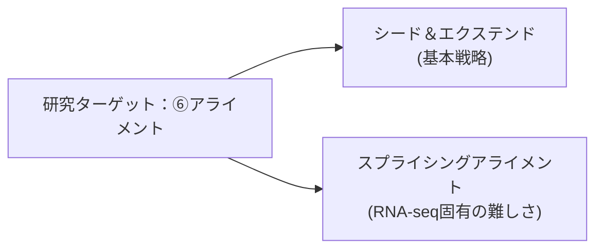

# バイオインフォ入門（全体像のハブ）

> [!note] 立ち位置
> 普段は回路設計が専門で、バイオインフォマティクスはゼロからのスタート。
> ここではまず「全体の地図」を持ち、各工程の詳細は [[用語・手法ノート]] 配下に1トピックずつ深掘りしていく。

---

## RNA-seq解析の全体パイプライン

## 回路屋アナロジー対応表

| 工程 | やっていること | 回路・信号処理での近い概念 |
|---|---|---|
| ①〜③ サンプル調製〜シーケンシング | 生体分子からデータを取得する | アナログセンサでの信号取得 |
| ④ ベースコーリング | 電流波形 → 塩基配列(ATGC)への変換 | ADC（アナログ→デジタル変換）。実際ナノポアはニューラルネットで電流波形をデコードしている |
| ⑤ QC/トリミング | 品質の悪い読み取り部分を除去 | ノイズ除去・前処理フィルタ |
| ⑥ アライメント | 巨大な参照データの中から一致箇所を探す | 大規模な近似パターンマッチング（詳細は [[シード＆エクステンド方式]]） |
| ⑦⑧ 定量・下流解析 | 位置情報から意味のある統計量を出す | 後段のデータ集計・信号の意味づけ |

---

## 研究ターゲットの位置づけ

[[NGS Hard Acceleration]] で扱っているのは、上記のうち **⑥アライメント** 工程。
特に対象がナノポア（ロングリード）のRNA-seqであることから、以下の2つの技術要素が重なっている。

1. **シード＆エクステンド方式** — アライメントの基本戦略そのもの → [[シード＆エクステンド方式]]
2. **スプライシングアライメント** — RNA-seq特有の難しさ（イントロンがリード中で抜け落ちる問題）→ [[スプライシングアライメント]]

---

## 学習ログ（進捗トラッキング）

- [x] 全体パイプラインの俯瞰（①〜⑧）
- [x] シード＆エクステンド方式の基本 → [[シード＆エクステンド方式]]
- [x] スプライシングアライメント（イントロン抜け落ち問題）→ [[スプライシングアライメント]]
- [x] FASTQ/SAM/BAM等のファイルフォーマット、Phredスコア、FLAG/MAPQ/CIGAR → [[ファイルフォーマット（FASTQ・SAM・BAM）]]
- [ ] Smith-Waterman型DPの詳細
- [ ] ベースコーリングの仕組み（ナノポア特有）
- [ ] 発現定量の考え方（リード数→発現量への変換）

## 関連ノート
- [[基礎学習]]
- [[用語・手法ノート]]
- [[NGS Hard Acceleration]]
- [[アルゴリズム・パイプライン設計]]
