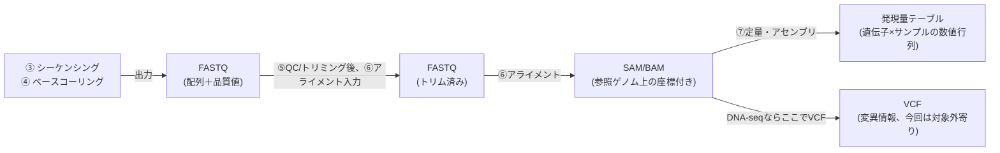

# ファイルフォーマット（FASTQ・SAM・BAM）

> [!note] 位置づけ
> [[バイオインフォ入門]] の各工程がどんなファイル形式でデータを受け渡ししているかを整理する。
> [[NGS Hard Acceleration]] でFPGA化する際、どの段階のデータを入出力させるかによって
> 扱うべきパーサ/ジェネレータが変わるため、実装設計の前提として重要。

---

## パイプラインとファイル形式の対応



回路屋的に言うと、これは「信号処理チェーンの各段のデータフォーマット定義」。FPGA実装ではどの段階を入出力にするかで、扱うパーサ/ジェネレータが変わる。

---

## 1. FASTQ形式（アライメント前の入力）

4行1組でリード1本を表す、シンプルなテキスト形式。

```
@read001                          ← ①ヘッダ行(リードのID)
ACGTACGGTTCAGGCTAGCATGCA          ← ②配列本体(ATGC)
+                                 ← ③区切り行(通常空)
IIIIIHHHFFFAA!!!!IIIIIIII         ← ④品質値(1文字=1塩基の信頼度)
```

- ②配列はそのまま文字列/バイト列として扱える（回路的には2bit/3bitにパックしやすい）
- ④品質値は「Phredスコア」をASCII文字にエンコードしたもの（詳細は次節）
- ナノポアはリード長がまちまち（数百bp〜数十kb）で、Illuminaのような固定長ではない点が特徴

---

## 2. 品質値（Phredスコア／Q値）

### 定義

$$Q = -10 \log_{10}(P_{error})$$

エラー確率を対数圧縮した表現。音響のdB計算と同じ構造（10倍で常用対数）。

| Qスコア | エラー確率 $P_{error}$ | 意味 |
|---|---|---|
| Q10 | 1/10 (10%) | かなり低品質 |
| Q20 | 1/100 (1%) | 業界的な最低ライン |
| Q30 | 1/1000 (0.1%) | Illuminaの標準的な良品質 |
| Q40 | 1/10000 (0.01%) | 非常に高品質 |

### ASCIIへのエンコード（Phred+33）

$$\text{ASCII文字} = \text{chr}(Q + 33)$$

例：Q=40 → `chr(73)` = `'I'`　／　Q=0 → `chr(33)` = `'!'`

「+33オフセット」は印字可能なASCII範囲に収めるための下駄履き（固定小数点的なスケーリング＆オフセットに相当）。現在の主要ツールはほぼこれで統一（昔のPhred+64との混在は事故の元）。

### ナノポア特有の事情

> [!important] ナノポアの品質値はIlluminaと性質が違う
> - Illumina：各塩基を独立に光学的に読み取る → Phredスコアは「その1塩基だけのエラー率」という素直な意味
> - ナノポア：電流波形を連続的に読み、ニューラルネットのベースコーラーが塩基配列に変換する（[[バイオインフォ入門]]で「ADC」に例えた工程）
>   → 1塩基のQ値は「モデルが出力した予測の信頼度」に近い性質
> - ナノポア全体としてIlluminaよりエラー率が高め（改善は進んでいるが依然傾向として高い）
>
> これが [[NGS Hard Acceleration]] の「ナノポアは低品質だがロングリードが有利」の“低品質”側の具体的な中身。

### アライメントとの接続

- [[06.2_シード探索とエクステンド|シード探索とエクステンド]] のエクステンド段階（DP）で、ミスマッチのペナルティをQスコアに応じて重み付けすることがある
- [[06.3_スプライシングアライメント|スプライシングアライメント]] のジャンプ検出でも、低品質領域での誤検出を避けるために品質情報が参照されることがある
- SAMのMAPQ（後述）は個々の塩基のQとは別の、リード全体に対するスコア（紛らわしいが別物）

---

## 3. SAM/BAM形式（アライメント後の出力）

- **SAM** = テキスト形式（人間が読める）
- **BAM** = SAMのバイナリ圧縮版（実運用の主流。ファイルサイズが数十分の1）

### 具体例で読む1行

```
read001  0  chr7  55191822  60  50M200N30M  *  0  0  ACGTACGG...  IIIIIHHH...
```

| # | フィールド | 値(例) | 意味 |
|---|---|---|---|
| 1 | QNAME | `read001` | リード名 |
| 2 | FLAG | `0` | ビットフラグ |
| 3 | RNAME | `chr7` | マップされた染色体 |
| 4 | POS | `55191822` | マップ開始位置(1始まり) |
| 5 | MAPQ | `60` | マッピング信頼度 |
| 6 | CIGAR | `50M200N30M` | アラインの内訳 |
| 7-9 | (ペアエンド用) | `* 0 0` | 単一リードでは未使用 |
| 10 | SEQ | `ACGTACGG...` | リード配列 |
| 11 | QUAL | `IIIIIHHH...` | 品質値(Phred+33) |

### FLAG：ビットフラグ

回路のレジスタのビットフィールドそのもの。1個の整数で複数の状態を同時表現し、`FLAG & ビット値` のAND演算でデコードする。

| ビット(10進) | 意味 |
|---|---|
| 1 | ペアエンドの片方である |
| 4 | アンマップ（マップされなかった） |
| 16 | 逆鎖(リバース鎖)にマップされた |
| 256 | セカンダリアライメント(副次候補) |
| 2048 | スプリットアライメントの一部(スプライシング分割等) |

例：`FLAG=16` → マップ済み・逆鎖。`FLAG=0` → 正常に正鎖にマップ。

### MAPQ：マッピング信頼度（Phredスケール）

$$\text{MAPQ} = -10 \log_{10}(P_{wrong})$$

$P_{wrong}$ ＝「このリードが実は別の場所にマップされるべきだったのに、ここにマップされた確率」。

- `MAPQ=60` → $P_{wrong}=10^{-6}$ → ほぼ確実に正しい
- `MAPQ=0` → $P_{wrong}=1$ → 他の候補と区別がつかない（反復配列領域などで頻発）

> [!important] MAPQ（場所の確からしさ）とQUAL（塩基1個の確からしさ）は別物
> - QUAL：1塩基ごとに「この塩基はAである確率」（ベースコーラーの出力）
> - MAPQ：リード全体に対して「このマッピング位置が正しい確率」（アライナーの出力）
> - QUAL高・MAPQ低（読み取りは正確だがゲノム中に酷似配列が複数あり位置が曖昧）も、
>   QUAL低・MAPQ高（読み取りは怪しいがユニークな位置にしかマッチしない）も両方あり得る、独立した情報

### CIGAR：アラインの内訳を数式的に読む

`50M200N30M` の意味：

$$\text{リード} = \underbrace{50\text{塩基}}_{M:\text{マッチ/ミスマッチ}} + \underbrace{200\text{塩基}}_{N:\text{参照ゲノムをスキップ(イントロン)}} + \underbrace{30\text{塩基}}_{M:\text{マッチ/ミスマッチ}}$$

| 記号 | 意味 | リード上を消費 | 参照ゲノム上を消費 |
|---|---|---|---|
| M | マッチまたはミスマッチ | する | する |
| I | 挿入(リードにあって参照にない) | する | しない |
| D | 欠失(参照にあってリードにない、短い) | しない | する |
| N | スキップ(イントロンジャンプ、長い) | しない | する |
| S | ソフトクリップ(端の低品質部分を無視) | する | しない |

D(欠失)とN(スキップ)は「参照ゲノムだけ進む」点で同じ演算だが、**長さの意味が違う**（Dは小さな欠失変異、Nはスプライシングによる大きなイントロン）ため区別される。[[06.3_スプライシングアライメント|スプライシングアライメント]] の「イントロンジャンプ」は、SAM上ではこの `N` として記録される。

---

## 未消化・要復習

- [ ] BAM形式のバイナリレイアウト（実際のビット構造）
- [ ] VCF形式・発現量テーブルの具体的な中身（今回は優先度低め）
- [ ] ペアエンドリード関連のフィールド（今回はロングリード単読なので優先度低め）

## 関連ノート
- [[バイオインフォ入門]]
- [[06.2_シード探索とエクステンド|シード探索とエクステンド]]
- [[06.3_スプライシングアライメント|スプライシングアライメント]]
- [[NGS Hard Acceleration]]
